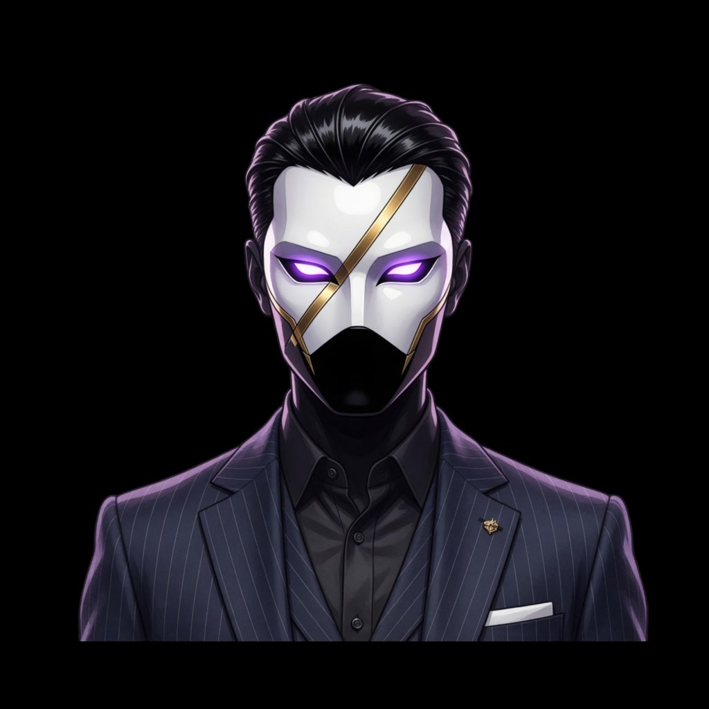
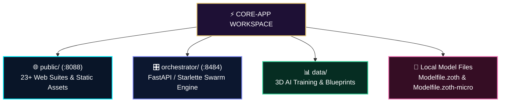

<div align="center">

#  ⚡ ZOTH STUDIO `core-app`

### *Web Suites, 3D CAD Omniverse, Autonomous Agents & Tool Runtime*

[](https://github.com/NullAITech/zoth-studio)
[](http://127.0.0.1:8088/)
[](http://127.0.0.1:8088/agents/)
[](http://127.0.0.1:8088/vault/)

<br>

<p align="center">
  
</p>

<!-- Live Animated Telemetry HUD -->
<p align="center">
  
</p>

</div>

<p align="center"></p>

##  🌟 Core Application Architecture

`core-app/` houses the primary web application suites, the Python FastAPI/Starlette multi-agent orchestrator, Three.js 3D CAD engines, and client-side cryptographic harnesses.



<p align="center"></p>

##  🏛️ Public Web Suites (`public/`)

| Directory / File | Port URL | Description & Purpose |
| :--- | :--- | :--- |
| **`public/zoth/`** | `http://127.0.0.1:8088/zoth/` | Flagship Master Azoth portal with Sacred Fibonacci geometry tokens. |
| **`public/studio/`** | `http://127.0.0.1:8088/studio/` | 14+ specialized studios (Nexus 3D, Consensus, Swarm, OmniPost, Vision Link). |
| **`public/agents/`** | `http://127.0.0.1:8088/agents/` | 21-Agent interactive sandbox pages and doctrine briefs. |
| **`public/comic/`** | `http://127.0.0.1:8088/comic/` | Cyber Graphic Novel webtoon reader, audio player, and timeline lore. |
| **`public/pets/`** | `http://127.0.0.1:8088/pets/` | 24 Cyber Pet companion 3D sanctuary, neon skins, and model studio. |
| **`public/vault/`** | `http://127.0.0.1:8088/vault/` | Argon2id BYOK key store interface with zero-leak memory wipe. |
| **`public/tools/`** | `http://127.0.0.1:8088/tools/` | 47+ client-side tool scripts, framework exporters, and sanitizers. |

<p align="center"></p>

##  🚀 Quickstart & Server Execution

```bash
# 1. Start public static web hub (:8088)
python3 -m http.server 8088 --bind 127.0.0.1 --directory public

# 2. Start operator orchestrator deck (:8484)
cd orchestrator
python3 orchestrator.py serve --host 127.0.0.1 --port 8484
```

---

<div align="center">
  
  <br>
  <strong>Zoth Studio Core Team</strong> · Licensed under the Apache License 2.0
</div>
