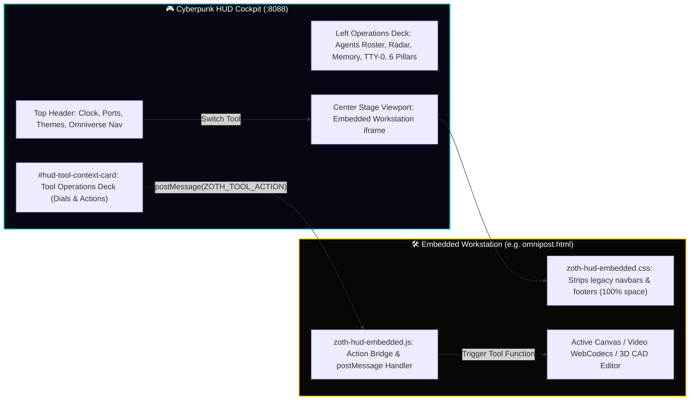

<div align="center">

#  🌌 ZOTH STUDIO: CORE APP & WORKSTATION SUITE (v3.2.0)
### *Sovereign Local-First AI Agent Workstation Suite, Cyberpunk HUD & Autonomous Web Foundry*

[](https://github.com/1nc0gn30/zoth-studio)
[-fbbf24?style=for-the-badge&logo=probot&logoColor=black)](public/docs/hermes-agent.md)
[](../LICENSE)
[](http://127.0.0.1:8088/)
[](http://127.0.0.1:8088/agents/)
[-00f0ff?style=for-the-badge&logo=electron&logoColor=white)](http://127.0.0.1:8088/studio/cyberpunk-hud.html)
[-f472b6?style=for-the-badge&logo=rust&logoColor=white)](http://127.0.0.1:8088/vault/)
[-10b981?style=for-the-badge&logo=brainz&logoColor=white)](http://127.0.0.1:8088/memory/)

<br>

<p align="center">
  
</p>

<!-- Live Animated Telemetry HUD -->
<p align="center">
  
</p>

<p align="center">
  <strong><a href="http://127.0.0.1:8088/studio/cyberpunk-hud.html">🎮 Launch Cyberpunk HUD</a></strong> •
  <strong><a href="http://127.0.0.1:8088/studio/omnipost.html">🎬 OmniPost Video Studio</a></strong> •
  <strong><a href="http://127.0.0.1:8088/studio/3d-editor.html">🪐 Nexus 3D CAD Viewport</a></strong> •
  <strong><a href="http://127.0.0.1:8088/studio/swarm.html">⚡ Swarm Arena</a></strong> •
  <strong><a href="http://127.0.0.1:8088/memory/">🧠 STDP Memory Matrix</a></strong> •
  <strong><a href="http://127.0.0.1:8088/docs/">📖 Docs Hub</a></strong>
</p>

</div>

<p align="center"></p>

## 🛡️ Core App Overview & Scope

`core-app` is the primary frontend workstation suite, CLI execution cockpit, and Unix PTY harness for **Zoth Studio**. It provides 28+ zero-cloud, client-side web workstations serving the entire 21-agent Pantheon, WebGen autonomous code synthesis, real-time 3D spatial monitoring, the **AI Math Pillars Theory Academy**, the **12-Formula #つぶやきProcessing Topology Lab**, and the **Cyberpunk Video Game HUD Cockpit**.

### Directory Structure & Subsystems:
- **`bin/zoth`**: High-performance Python 3 CLI & Curses TUI symlinked globally to `~/.local/bin/zoth`.
- **`public/studio/`**: 28+ static web workstations, CAD viewports, video studio, consensus crucible, and sandboxes.
- **`public/assets/`**:
  - `zoth-cyberpunk-hud.js` & `zoth-cyberpunk-hud.css`: Master 2-column tactical video game HUD engine.
  - `zoth-hud-embedded.js` & `zoth-hud-embedded.css`: Universal embedded workspace adapter and bi-directional action bridge.
  - `zoth-theme.css`: 4-Theme engine (`dark`, `light`, `matrix`, `gold`) with WCAG AA contrast.
- **`public/docs/`**: Comprehensive markdown architectural manuals, theory proofs, and agent guides.
- **`tools/`**: Local Unix PTY engine (`pty.fork`), DuckyScript compiler, and loopback agent orchestrator (`:8484`).

---

## 🎮 Cyberpunk HUD Cockpit & Embedded Workstation Engine

The Cyberpunk HUD creates a tactical desktop operations environment:



### Key Capabilities:
1. **Zero-Root Scroll Cockpit**: 100vh desktop layout with chamfered sci-fi borders, scanning LEDs, and animated holographic atmosphere.
2. **360° Polar Radar Sweep**: Tracks 21 swarm agents across 4 celestial quadrants with click-to-attune agent selection.
3. **Real-Time Audio Scope**: 60 FPS Web Audio oscilloscope featuring Waveform, FFT Spectrum, and XY Lissajous modes.
4. **Dual-Tool Split Stage**: Side-by-side split screen (`[ ◫ SPLIT ]`) for simultaneous editing and previewing.
5. **Tool-Specific Operations Deck**: Dynamically reskins when any tool loads, presenting quick dials tailored to that workstation.

---

## 🕊️ Hermes Agent CLI & Terminal REPL Integration

The HUD TTY-0 Terminal REPL connects directly to **Nous Research Hermes Agent (v0.21.2)**:

| Command | Action & Telemetry Output |
|:---|:---|
| `hermes status` | Inspects Hermes v0.21.2 engine, active `azoth-prime` profile, and loaded skills (270+). |
| `hermes doctor` | Runs complete diagnostics on tool availability, SQLite state DB, and memory daemon. |
| `hermes <task>` | Dispatches autonomous subagent tasks with real-time feedback in the HUD message stream. |
| `split` / `split swap` | Toggles and swaps dual-tool split stage mode between two workstations. |
| `radar ping` / `radar zoom` | Broadcasts sweep ping to all 21 swarm agents and scales radar range. |
| `scope wave` / `scope fft` | Toggles real-time audio oscilloscope between waveform and frequency FFT modes. |
| `pillars` | Computes live values across all 6 mathematical calculus pillars. |
| `theme <name>` | Switches 4-theme engine (`dark`, `light`, `matrix`, `gold`). |

> [!NOTE]
> Pressing **`Tab`** in the HUD Terminal REPL activates smart auto-completion across all commands.

---

## 🛠️ Complete Workstation Inventory (`public/studio/`)

<div align="center">

| Workstation | Direct URL | Runtime | Primary Function |
|:---|:---|:---:|:---|
| **Cyberpunk HUD Cockpit** | [`/studio/cyberpunk-hud.html`](http://127.0.0.1:8088/studio/cyberpunk-hud.html) | `HTML5 / JS` | Flagship 2-column video game cockpit & stage loader |
| **OmniPost 2.0 Video** | [`/studio/omnipost.html`](http://127.0.0.1:8088/studio/omnipost.html) | `WebCodecs / Canvas` | 60 FPS client-side video studio & synth music creator |
| **Nexus 3D CAD Editor** | [`/studio/3d-editor.html`](http://127.0.0.1:8088/studio/3d-editor.html) | `Three.js / WebGL` | CAD-grade 3D viewport, mesh deformer, GLTF exporter |
| **Swarm Arena** | [`/studio/swarm.html`](http://127.0.0.1:8088/studio/swarm.html) | `WebGL 2D/3D` | 21-Agent kinetic spatial swarm & laser triangulation |
| **Consensus Crucible** | [`/studio/consensus.html`](http://127.0.0.1:8088/studio/consensus.html) | `Wasm / AST Parser` | 3-Model dialectic arbitration ($H < 0.20$ bits) |
| **AI Math Pillars Academy**| [`/studio/math-pillars.html`](http://127.0.0.1:8088/studio/math-pillars.html) | `KaTeX / Canvas` | 6 Sacred Mathematical Pillars interactive proofs |
| **Netrunner Memory** | [`/studio/netrunner-memory.html`](http://127.0.0.1:8088/studio/netrunner-memory.html)| `SSE / REST` | Biomorphic STDP synaptic weight graph & memory link |
| **WebGen Studio** | [`/studio/webgen.html`](http://127.0.0.1:8088/studio/webgen.html) | `Vite / Astro` | Full-stack autonomous site synthesizer & ZIP exporter |
| **Tool Nexus Explorer** | [`/studio/tool-nexus.html`](http://127.0.0.1:8088/studio/tool-nexus.html) | `JSON / JS` | Searchable index of 298+ tools with contract inspector |
| **Keymaster Vault** | [`/vault/index.html`](http://127.0.0.1:8088/vault/) | `Rust / Argon2id` | Cryptographic secret storage & XChaCha20 cipher |
| **Pet Dex Sanctuary** | [`/pets/studio.html`](http://127.0.0.1:8088/pets/studio.html) | `Three.js / Audio` | 24 alchemical companion spirits & summon commands |
| **SubSweep Cleaner** | [`/studio/subsweep.html`](http://127.0.0.1:8088/studio/subsweep.html) | `Node.js` | Workspace cruft cleaner & dev artifact pruner |

</div>

---

## 🧪 Verification & Automated Testing

The Core App includes an automated 17-suite test harness verifying all HUD visualizers, adapters, and agent bridges:

```bash
# Execute the comprehensive HUD verification suite
node public/assets/zoth-cyberpunk-hud.test.js
```

```
⚡ Running Cyberpunk HUD Tactical Visualizers Verification Tests...

✔ Test 1 Passed: zoth-cyberpunk-hud.js exists (159KB)
✔ Test 2 Passed: Master HUD Controller API initialized and tactical methods exposed
✔ Test 3 Passed: Real-Time Audio Oscilloscope operates across wave, fft, and lissajous modes
✔ Test 4 Passed: 360° Polar Radar Sweep Mini-Map tracks all 21 swarm agents correctly
✔ Test 5 Passed: Complete 6-Pillar Mathematical Calculus telemetry verified
✔ Test 6 Passed: Interactive Memory Graph node clicking & consolidation waves verified
✔ Test 7 Passed: Dynamic Stage Tool Loader & Stage History verified
✔ Test 8 Passed: Dual-Tool Split Stage Mode verified
✔ Test 9 Passed: Active Agents Selector switches across 21 agents with voice feedback
✔ Test 10 Passed: 4-Theme Engine cycles between dark, light, matrix, and gold
✔ Test 11 Passed: Modals (ports, pillars, toolmgr) and live logging operational
✔ Test 12 Passed: Omniverse Navigator & Tool Router open/close and filter verified
✔ Test 13 Passed: URL State Synchronization & backwards-compatible aliases verified
✔ Test 14 Passed: Universal Embedded Workspace Adapters & Navbar/Footer Cleaner verified
✔ Test 15 Passed: Tool-Specific HUD Context Card & 10 Workstation Profiles verified
✔ Test 16 Passed: Bi-Directional Action Bridge & Event Dispatch verified
✔ Test 17 Passed: Hermes Agent Integration, Dispatch & REPL Autocomplete verified

⭐ ALL 17 CYBERPUNK HUD TACTICAL VISUALIZERS, OMNIVERSE, HERMES & ACTION BRIDGE TESTS PASSED (100%)!
```

---

## 📜 Documentation Guides

- 🕊️ **[Hermes Agent Architecture Guide](public/docs/hermes-agent.md)**
- 🎮 **[Cyberpunk HUD Cockpit Manual](public/docs/cyberpunk-hud.md)**
- 🏛️ **[Home & Sanctum Architecture](public/docs/home-sanctum.md)**
- 🧠 **[Biomorphic Memory & CLS Theory](public/docs/README.md)**
- 🎨 **[Brand & Visual Identity Spec](public/brand/README.md)**
