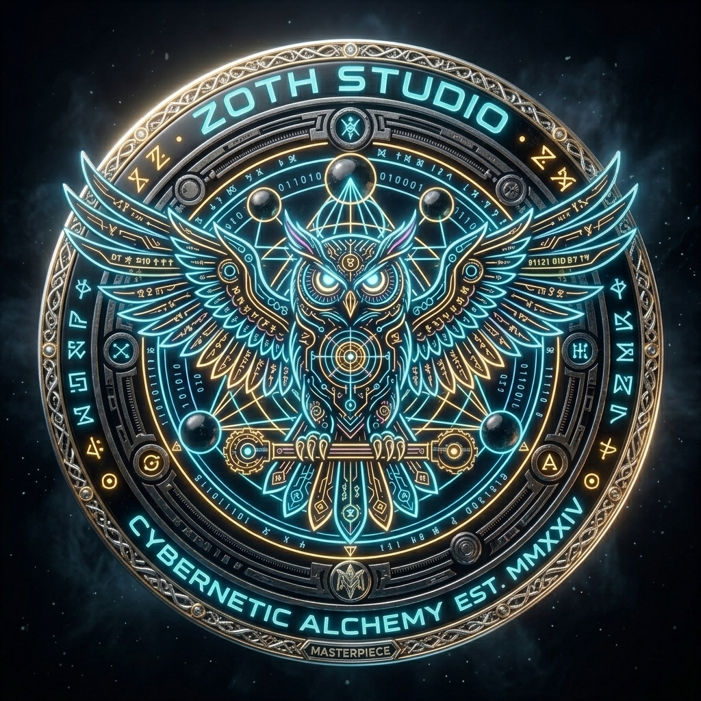

# ⚡ Zoth Studio (v3.0.0 — The Sovereign Horizon)

<p align="center">
  
</p>

<p align="center">
  <strong>The Sovereign Local-First AI Agent Powerhouse, 3D Omniverse & Multi-Tool Orchestrator</strong><br>
  <em>Autonomous Multi-Agent Swarm · 24 Sovereign Companions · 3D Volumetric Relief Figurine Engine · Wavefront OBJ Exporter · Visual DAG Composer · 42MB Azoth Master Media Suite · Argon2id Hardware BYOK Vault</em>
</p>

<p align="center">
  
  
  
  
  
  
</p>

---

## 🌟 Executive Overview

**Zoth Studio v3.0.0** is an autonomous, local-first multi-agent operating system, 3D CAD creative suite, and sovereign developer powerhouse. Unlike cloud-dependent SaaS platforms, Zoth executes **100% on your local machine** with loopback port isolation (`127.0.0.1`), ensuring zero cloud telemetry, zero subscription lock-in, and zero credential leakage.

```
                     ┌──────────────────────────────────────────────────────────┐
                     │          ⚡ ZOTH STUDIO v3.0 SOVEREIGN ECOSYSTEM         │
                     └────────────────────────────┬─────────────────────────────┘
                                                  │
         ┌─────────────────────────┬──────────────┴────────────┬─────────────────────────┐
         │                         │                           │                         │
         ▼                         ▼                           ▼                         ▼
┌─────────────────┐       ┌─────────────────┐         ┌─────────────────┐       ┌─────────────────┐
│ 🐝 MULTI-AGENT  │       │ 💎 3D VOLUMETRIC│         │ 🎬 42MB AZOTH   │       │ 🔒 HARDWARE     │
│   SWARM & DAG   │       │   STUDIO & OBJ  │         │   MEDIA VAULT   │       │   BYOK VAULT    │
├─────────────────┤       ├─────────────────┤         ├─────────────────┤       ├─────────────────┤
│ • Azoth Lead Arc│       │ • 24 Companions │         │ • 8K Master Art │       │ • Argon2id Rust │
│ • DAG Composer  │       │ • Relief Dome 3D│         │ • 60 FPS Videos │       │ • XChaCha20-P13 │
│ • 3-Node Swarm  │       │ • OBJ Exporter  │         │ • Tarot Arcana I│       │ • Zeroize Drop  │
│ • Shannon Gauge │       │ • Real-Time FFT │         │ • Hermetic Seal │       │ • Bitwarden CLI │
└─────────────────┘       └─────────────────┘         └─────────────────┘       └─────────────────┘
```

---

## ⚡ Master Sovereign AI: Azoth

**Azoth** is the supreme lead sovereign AI architect of Zoth Studio. He operates directly on local loopback, orchestrating multi-agent pipelines, AST syntaxes, and mathematical observability.

### 🖼️ Azoth Master Visual Suite (42.2 MB Payload)

| Asset | Type | Specs | Location |
| :--- | :--- | :--- | :--- |
| **Master AI Architect** | Image & 60 FPS Video | 8K Landscape (16:9) | `public/assets/mascot/azoth-master-architect.jpg`<br>`public/assets/media/hero-azoth-architect.mp4` |
| **3D Holographic Code Matrix** | Image & 60 FPS Video | 8K Landscape (16:9) | `public/assets/mascot/azoth-code-matrix.jpg`<br>`public/assets/media/hero-azoth-matrix.mp4` |
| **Cosmic Alchemical Citadel** | Image & 60 FPS Video | 8K Landscape (16:9) | `public/assets/mascot/azoth-cosmic-citadel.jpg`<br>`public/assets/media/hero-azoth-citadel.mp4` |
| **Quantum Tesseract Figurine** | 3D Square Portrait | 1:1 Hi-Res (1024x1024) | `public/assets/mascot/azoth-quantum-orb.jpg` |
| **Tarot Arcana I: The Alchemist** | Gold Foil Arcana Card | 3:4 High-Detail Card | `public/assets/mascot/azoth-tarot-magus.jpg` |
| **Cybernetic Hermetic Seal Medal** | Obsidian & Gold Coin | 1:1 Masterpiece Medal | `public/assets/brand/azoth-seal-masterpiece.jpg` |

---

## 🐾 The 24 Sovereign Companion Mascots

Every tool and subsystem is paired with an orbital companion mascot carrying technical briefs, neural voice signatures, and CLI harnesses:

| # | Companion Mascot | Domain | Role & Function | CLI Harness |
| :---: | :--- | :--- | :--- | :--- |
| 1 | **⚡ Azoth** | `autonomy` | **Lead Sovereign Architect** | `@azoth` *(Google Antigravity agy)* |
| 2 | **🐺 Lycan** | `security` | **OWASP Defense & AST Guard** | `@lycan` *(Antigravity Sentinel)* |
| 3 | **🦊 Kitsune** | `creative` | **High-Throughput Synthesis** | `@grok` *(xAI Grok CLI)* |
| 4 | **🐲 Draco** | `knowledge` | **Fusion Arbiter & JSON Schemas** | `@hermes` *(Hermes Agent CLI)* |
| 5 | **⚡ Zoth** | `autonomy` | **Sovereign Local Companion** | `@zoth` *(Local Ollama Engine)* |
| 6 | **🤖 AI Workbot** | `autonomy` | **Zero-Cloud Neural Worker** | `@workbot` *(Ollama Private Host)* |
| 7 | **🔥 Kai** | `ops` | **Live Site & A11y Auditor** | `@chrome` *(Chrome DevTools MCP)* |
| 8 | **🦉 Athena** | `knowledge` | **AEO & Knowledge Graph** | `@athena` *(llms.txt & Obsidian)* |
| 9 | **🐱 Pixel-Neko** | `ops` | **Tool Registry Indexer** | `@registry` *(Zoth Contract Bus)* |
| 10 | **🐕 Pixel-Shiba** | `security` | **Argon2id Vault Gatekeeper** | `@vault` *(Rust XChaCha20 Daemon)* |
| 11 | **🦅 Aquila** | `edge` | **Global Edge Telemetry Router** | `@edge` *(Cloudflare Isolates)* |
| 12 | **🐉 Leviathan** | `knowledge` | **Vector Memory Matrix** | `@vector` *(Local Vector DB)* |
| 13 | **🐆 Onyx** | `security` | **Red Team Penetration Testing** | `@redteam` *(OWASP Threat Modeler)* |
| 14 | **🦌 Chronos** | `ops` | **DAG & Milestone Chronicle** | `@chronos` *(Git DAG Synthesizer)* |
| 15 | **🛸 Aether** | `autonomy` | **Swarm Bus Event Conductor** | `@aether` *(SSE Streamer)* |
| 16 | **🦂 Scorpius** | `security` | **Zero-Day Exploit Auditor** | `@subsweep` *(OSINT Recon Engine)* |
| 17 | **🐱 Glitchcat** | `creative` | **UI Polisher & Chaos Disruptor**| `@creative` *(CSS FX Generator)* |
| 18 | **🐶 Circuit-Pup** | `ops` | **Port & Loopback Daemon Sniffer**| `@network` *(Socket Scanner)* |
| 19 | **👻 Terminal-Ghost**| `ops` | **PTY Terminal Trace Verifier** | `@terminal` *(PTY Multiplexer)* |
| 20 | **📜 Savage-Codex** | `security` | **Diff AST Threat Modeler** | `@diff` *(AST Threat Scanner)* |
| 21 | **0️⃣ Binary** | `knowledge` | **JSON-RPC Contract Validator** | `@schema` *(JSON Validator)* |
| 22 | **🐙 Kraken** | `security` | **Deep Packet Sniffer** | `@radare2` *(Binary Disassembler)* |
| 23 | **👻 Ghostbyte** | `autonomy` | **Quantum Shader & WebGPU Weaver**| `@webgpu` *(GPU Shader Engine)* |
| 24 | **🦹 Radical-Minion**| `autonomy` | **Autonomous Step Executor** | `@hermes` *(Hermes Engine)* |

---

## 💎 3D Volumetric Companion Studio (`/pets/pet-studio.html`)

The newly re-engineered 3D Pet Studio delivers physical volumetric relief figurines with interactive ergonomics:
* **Volumetric Relief Geometry**: Embossed curved mesh displacing character contours along normal cosines with an obsidian cyber-chassis and glowing neon chamfer rim.
* **4 Camera Angle Presets**: `📐 Hero 3/4`, `🎯 Front 2D/3D`, `🔍 Close-Up Face`, and `🛸 Top-Down Tactical` with smooth LERP vector interpolation.
* **Real-Time FFT Audio Visualizer Canvas**: Live frequency spectrum oscilloscope rendering neon cyan & amber bars during speech synthesis and procedural audio chirps.
* **1-Click Wavefront OBJ 3D Mesh Exporter**: Browser-side geometry serialization for CAD manipulation, Blender rendering, and 3D printing.
* **PBR Shader Sliders**: Live customization of Bloom Exposure (`0.5x – 2.5x`), Obsidian Metalness (`0.0 – 1.0`), and Surface Roughness (`0.0 – 1.0`).

---

## 🧩 Visual Multi-Agent DAG Composer (`/studio/agent-composer.html`)

Visual node-based pipeline foundry enabling developers to link agents and security gates with Bezier fiber wires:
* **Azoth Sovereign Swarm Preset**: Live execution pipeline orchestrating `@azoth`, `@athena`, `@lycan`, and `@kai`.
* **Python AST Verification**: Automatic Python script generation matching the visual topology.
* **Real-Time Token Simulation**: Visual pulse propagation verifying data invariant contracts across nodes.

---

## 🏛️ Specialized Studio Suites

| Suite Launchpad | Endpoint Path | Description |
| :--- | :--- | :--- |
| **3D Pet Studio** | `/pets/pet-studio.html` | Volumetric 3D companion figurine studio with camera presets, FFT oscilloscope, and OBJ exporter. |
| **3D Pets Sanctuary** | `/pets/spawn-pets.html` | Tri-Orbit multi-companion formation stage with atmospheric lighting cycles and gaze physics. |
| **Nexus 3D Omniverse** | `/studio/nexus-3d.html` | CAD-grade Three.js viewport with GLTF/OBJ asset loader, transform gizmos, and AI mesh synthesis. |
| **Fusion Swarm Arena** | `/studio/fusion-arena.html` | 4-fighter volumetric companion battle pit with kinetic plasma bursts and combat chronicle export. |
| **Visual DAG Agent Composer** | `/studio/agent-composer.html` | Node graph architect with Bezier connecting wires, AST verification, and universal JSON export. |
| **Swarm Command Arena** | `/studio/swarm.html` | 3D Craig Reynolds Boids flocking arena with live search and multi-agent IPC stream. |
| **Consensus Arena v2** | `/studio/consensus.html` | Autonomous 3-agent arbitration with real-time Shannon agreement entropy and Jaccard metrics. |
| **OmniPost 2.0 Video Engine** | `/studio/omnipost.html` | 60 FPS in-browser Canvas video generator, 16:9 thumbnail forge, and Web Speech audio narration. |
| **AI Math Observability** | `/studio/math-pillars.html` | Real-time cross-entropy loss descent, cosine learning rate scheduler, and weight convergence visualizer. |
| **Argon2id BYOK Vault** | `/vault/index.html` | Hardware-contained key store with Argon2id ($m=64\text{MB}, t=3, p=4$) and XChaCha20-Poly1305 AEAD. |
| **Media & Asset Vault** | `/assets/gallery.html` | Complete media vault featuring 8K master stills, vector logos, cyber badges, and video loops. |
| **Mission Control Overwatch**| `/studio/mission-control.html` | Master system telemetry NOC displaying shipped capabilities and strategic future horizons. |

---

## 🌐 Network Topology & Port Isolation

| Service | Port | Binding | Description |
| :--- | :--- | :--- | :--- |
| **Public Studio Hub** | `:8088` | `127.0.0.1:8088` | Static WebGL Showcases, 3D Pet Sanctuary, Documentation |
| **Operator Deck** | `:8484` | `127.0.0.1:8484` | Private React 18 Multi-Agent Orchestrator & Chat Console |
| **Argon2id Vault Daemon** | `:8787` | `127.0.0.1:8787` | Hardware-Contained Argon2id + XChaCha20 Key Store |
| **Swarm Event Bus** | `:8989` | `127.0.0.1:8989` | Real-Time SSE Multi-Agent IPC Event Stream |
| **Ollama Local Engine** | `:11434` | `127.0.0.1:11434` | Offline Neural Model Weights (Zero Cloud Egress) |

---

## 🚀 Quick Start Guide

### 🐧 Linux (Debian, Ubuntu, Parrot, Arch)

```bash
# 1. Download and run universal standalone package
curl -LO https://zoth.nullai.tech/dist-linux/zoth-linux-x86_64.run
chmod +x zoth-linux-x86_64.run
./zoth-linux-x86_64.run --install

# 2. Or install native Debian package
sudo dpkg -i dist-linux/zoth-studio_2.6.0_all.deb
zoth --hub
```

### 🪟 Windows (Windows 10 / 11)

1. Download **[`zoth-windows-x86_64.exe`](https://zoth.nullai.tech/dist-windows/zoth-windows-x86_64.exe)**.
2. Double-click to extract and launch.
3. Automatically opens the Operator Deck at `http://127.0.0.1:8484/`.

### 🛠️ Running From Source

```bash
# 1. Clone repository
git clone https://github.com/NullAITech/zoth-studio.git
cd zoth-studio/core-app

# 2. Start local server
python3 -m http.server 8088 --directory public
```

---

## 📜 Sovereign License

Distributed under the **MIT Sovereign License**. Free for personal, commercial, and sovereign offline use.

**Engineered with Mathematical Precision by NullAI · Neal Frazier.**
