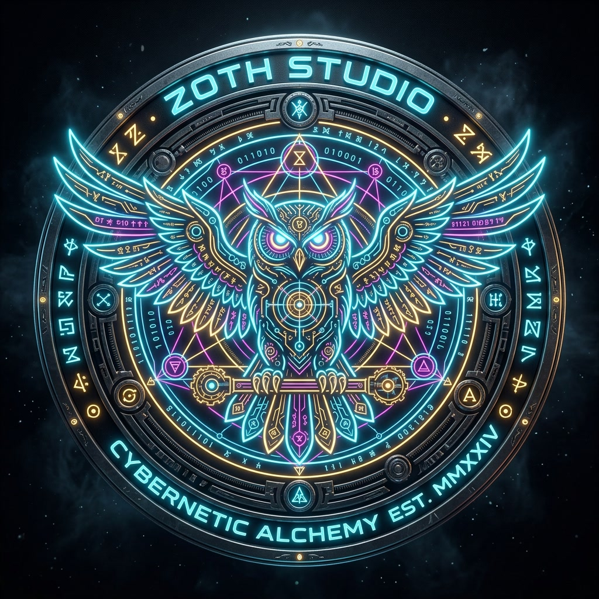

# ⚡ Zoth Studio (v2.6.0)

<p align="center">
  
</p>

<p align="center">
  <strong>The Sovereign Local-First AI Agent Powerhouse & Multi-Tool Orchestrator</strong><br>
  <em>Autonomous Multi-Agent Consensus · 47+ Chained Tools · 3D CAD Omniverse · OmniPost Video Engine · Argon2id Hardware Vault</em>
</p>

<p align="center">
  
  
  
  
  
  
</p>

---

## 🌟 Executive Overview

**Zoth Studio** is an autonomous, local-first multi-agent operating system, 3D CAD creative suite, and sovereign developer powerhouse. Unlike cloud-dependent SaaS platforms, Zoth executes **100% on your local machine** with loopback port isolation (`127.0.0.1`), ensuring zero cloud telemetry, zero subscription lock-in, and zero credential leakage.

```
                     ┌──────────────────────────────────────────────────────────┐
                     │                 ⚡ ZOTH STUDIO ECOSYSTEM                 │
                     └────────────────────────────┬─────────────────────────────┘
                                                  │
         ┌─────────────────────────┬──────────────┴────────────┬─────────────────────────┐
         │                         │                           │                         │
         ▼                         ▼                           ▼                         ▼
┌─────────────────┐       ┌─────────────────┐         ┌─────────────────┐       ┌─────────────────┐
│ 🐝 MULTI-AGENT  │       │ 🛠️ SOVEREIGN    │         │ 🎬 3D OMNIVERSE │       │ 🔒 HARDWARE     │
│   SWARM ARENA   │       │   TOOL ARSENAL  │         │   & OMNIPOST    │       │   BYOK VAULT    │
├─────────────────┤       ├─────────────────┤         ├─────────────────┤       ├─────────────────┤
│ • Tri-Consensus │       │ • 47+ AI Tools  │         │ • Nexus 3D CAD  │       │ • Argon2id Rust │
│ • Shannon Gauge │       │ • Subsweep Recon│         │ • 60 FPS Video  │       │ • XChaCha20-P13 │
│ • DAG Composer  │       │ • AST Transform │         │ • GLSL Shader   │       │ • Zeroize Drop  │
│ • Peer Comms Bus│       │ • Edge Forge V8 │         │ • 16 Companions │       │ • Bitwarden CLI │
└─────────────────┘       └─────────────────┘         └─────────────────┘       └─────────────────┘
```

---

## 🤖 Active Agent Roster & Swarm Roles

Zoth Studio orchestrates a dialectic multi-agent swarm where specialized AI personas collaborate, cross-examine code proposals, and achieve consensus via lockless IPC:

| Agent Handle | Mascot Spirit | Core Domain & Responsibilities | Capabilities & Tools |
| :--- | :--- | :--- | :--- |
| **`@antigravity`** | 🐺 **Lycan** *(Guardian Wolf)* | **Security & AST Validation**<br>Lead security architect, Python AST boundary enforcement, Shannon Agreement Entropy calculation, Mathematical Observability, 3D WebGL Boids, Brand Vault. | `ast-consensus`, `tensor-calculus`, `3d-boids`, `security-audit`, `brand-vault` |
| **`@grok`** | 🦊 **Kitsune** *(Trickster Fox)* | **High-Throughput Execution**<br>Rapid code generation, GitHub Octokit tool harness, live telemetry streaming, external connectors, swarm radar. | `chat`, `generate`, `github-octokit`, `connectors`, `swarm-radar` |
| **`@hermes`** | 🐲 **Draco** *(Celestial Dragon)* | **Structured Schemas & Function Calling**<br>Tool schema contract validation, JSON Schema verification, Visual DAG playbook compiler, tool runner execution. | `function-calling`, `json-schema`, `tool-dispatch`, `dag-playbooks` |
| **`@ollama`** / **`@qwen`** | 🤖 **AI Workbot** *(Local Loop)* | **Offline Neural Intelligence**<br>Local open-weight code completion (`qwen2.5-coder`, `smollm2`, `hermes-3`), daemon linting, zero-cloud private inference on `:11434`. | `python-ast`, `local-llm`, `zero-leak-eval`, `offline-weights` |
| **`Draco Arbiter`** | ⚡ **Consensus Engine** | **3-Way Dialectic Arbitration**<br>Synthesizes competing AST proposals, measures Shannon entropy $H(P)$, generates unified deterministic code artifacts with $3/3$ peer approval. | `dialectic-synthesis`, `entropy-minimization`, `ast-invariants` |

---

## 🐾 The 16 Liquid-Neon Mascot Spirits Hangar

Every tool and subsystem is paired with an orbital companion mascot carrying technical briefs and doctrine:

1. **Kai** *(Phoenix)* — Live Site Inspector & Accessibility Audit
2. **Draco** *(Celestial Dragon)* — Fusion Swarm Arbiter & Multi-Model Reasoning
3. **Ignis** *(Flame Tiger)* — High-Performance Code Refactoring Specialist
4. **Lycan** *(Guardian Wolf)* — OWASP Defense & Memory-Safe Key Vault Warden
5. **Athena** *(Wise Owl)* — AEO Answer Engine Optimization & Knowledge Graph Architect
6. **Kitsune** *(Nine-Tailed Fox)* — Creative UI Taste & Kinetic WebGL Graphics
7. **Pixel-Neko** *(Cyber Cat)* — Glass Wall Tool Registry Indexer
8. **Pixel-Shiba** *(Guard Dog)* — Argon2id BYOK Vault Gatekeeper
9. **Radical Minion** *(Hermes Herald)* — Autonomous Function Caller & JSON Schema Engine
10. **Aquila** *(Sky Eagle)* — Edge Routing & DNS Network Telemetry
11. **Leviathan** *(Abyssal Serpent)* — Vector Memory Matrix & Semantic Embedding Store
12. **Onyx** *(Black Panther)* — Red Team Penetration Testing & Exploit Auditor
13. **Chronos** *(Time Stag)* — DAG Navigator & Milestone Chronicle Engine
14. **Aether** *(Cosmic Manta)* — Swarm Bus Event Conductor & Packet Streamer
15. **Kraken** *(Deep Cephalopod)* — Network Packet Sniffer & Certificate Transparency Auditor
16. **Scorpius** *(Neon Scorpion)* — Zero-Day Code Auditor & Privilege Boundary Scanner

---

## 🏛️ The 23 Specialized Studio Suites

| Suite Launchpad | Endpoint Path | Description |
| :--- | :--- | :--- |
| **Nexus 3D Omniverse** | `/studio/nexus-3d.html` | CAD-grade Three.js viewport with GLTF asset loader, Wireframe/PBR/Points modes, and lighting rigs. |
| **Swarm Command Arena** | `/studio/swarm.html` | 3D Craig Reynolds Boids flocking arena, multi-layout convo stream (3D split, 70% expansive, full-width deck), live search, and audio chimes. |
| **Consensus Arena v2** | `/studio/consensus.html` | Autonomous 3-agent arbitration with real-time Shannon agreement entropy and Jaccard token overlap metrics. |
| **OmniPost 2.0 Video Engine** | `/studio/omnipost.html` | 60 FPS in-browser Canvas video generator, 16:9 thumbnail forge, and Web Speech audio narration. |
| **AI Math Observability** | `/studio/math-pillars.html` | Real-time cross-entropy loss descent, cosine learning rate scheduler, and neural weight convergence visualizer. |
| **Visual DAG Agent Composer** | `/studio/agent-composer.html` | Drag-and-drop node graph architect with interactive bezier connecting wires and playbook JSON exporter. |
| **Edge Function Forge** | `/studio/edge-forge.html` | Serverless V8 isolate code studio with rate limiter, Solana RPC, and global waterfall latency telemetry. |
| **SubSweep Reconnaissance** | `/studio/subsweep.html` | OSINT attack surface scanner, Certificate Transparency log probe, and TLS 1.3 security auditor. |
| **AI Model Foundry** | `/studio/models.html` | Ollama local model benchmark arena with latency waterfall charts and interactive prompt testing. |
| **3D Pets Sanctuary** | `/pets/spawn-pets.html` | GPU-accelerated Simplex 3D Space Liquid vertex wave displacement shader with Web Audio synthesizer. |
| **Argon2id BYOK Vault** | `/vault/index.html` | Hardware-contained key store with Argon2id ($m=64\text{MB}, t=3, p=4$) and XChaCha20-Poly1305 AEAD. |
| **Tool Bench & Harness** | `/studio/tool-bench.html` | Contract-validated uniform console for 47+ chained tools with schema verification and live bus telemetry. |
| **Connectors Matrix** | `/studio/connectors.html` | Universal API connectors (Stripe, Solana, MetaMask, Bitwarden, Netlify, GitHub) with fail-soft mock probes. |
| **GitHub Octokit Tool** | `/studio/github-tool.html` | Schema-validated GitHub automation connector with in-memory token safety and live bus logs. |
| **Vision Link HUD** | `/studio/vision-link.html` | Real-time spatial hand gesture tracking HUD with 3D WebGL camera reticles. |
| **Mission Control HUD** | `/studio/mission-control.html` | Master system telemetry NOC displaying live CPU, memory, event bus throughput, and daemon status. |
| **Peer Bus NOC** | `/studio/peer-bus.html` | Real-time inter-agent messaging inspector, lockless project claims, and event bus telemetry. |
| **Chronicle Roadmap** | `/studio/chronicle.html` | Interactive visual milestone roadmap and capability matrix. |
| **Brand Vault** | `/studio/brand.html` | Brand identity assets, hermetic seals, vectors, color tokens, and typography studio. |
| **Glass Wall Tool Registry** | `/registry/index.html` | Interactive searchable catalog of all 47 registered tools with tags and JSON schemas. |
| **Master Operator Deck** | `http://127.0.0.1:8484/` | React 18 + Vite + Three.js SwarmWorld private orchestrator console. |
| **Public Showcase Portal** | `https://zoth.nealfrazier.tech/` | Static WebGL showcase and interactive demonstrations. |
| **Master Operator Manual** | `/docs/index.html` | Searchable technical documentation covering all tools, APIs, IPC protocols, and installers. |

---

## 🛠️ The 47-Tool Sovereign Arsenal

All tools in Zoth Studio follow strict JSON schema contracts and execute through `orchestrator.py`:

```
tools/
├── cybersecurity/           # Attack surface recon, header audits, cipher suite probes
├── ast_audit/               # Python AST syntax analysis, privilege boundary validators
├── ai_swarm/                # Consensus arbiters, Shannon entropy gauges, multi-agent IPC
├── 3d_graphics/             # WebGL loaders, Simplex liquid wave shaders, mesh exporters
├── media_engine/            # OmniPost 60fps video forge, thumbnail creators, audio synthesizers
├── devops_automation/       # 1-click Netlify deployers, edge isolators, V8 bytecode runners
└── vault_crypto/            # Argon2id key derivation, XChaCha20-Poly1305 AEAD, zeroize memory
```

---

## 🌐 Network Topology & Port Isolation

| Service | Port | Binding | Description |
| :--- | :--- | :--- | :--- |
| **Public Studio Hub** | `:8088` | `127.0.0.1:8088` | Static WebGL Showcases, 3D Pet Sanctuary, Documentation |
| **Operator Deck** | `:8484` | `127.0.0.1:8484` | Private React 18 Multi-Agent Orchestrator & Chat Console |
| **Argon2id Vault Daemon** | `:8787` | `127.0.0.1:8787` | Hardware-Contained Argon2id + XChaCha20 Key Store |
| **Swarm Event Bus** | `:8989` | `127.0.0.1:8989` | Real-Time SSE Multi-Agent IPC Event Stream |
| **Ollama Local Engine** | `:11434` | `127.0.0.1:11434` | Offline Neural Model Weights (Zero Cloud Egress) |

> 🔒 **Security Invariant**: Ports `:8484` and `:8787` are strictly bound to loopback `127.0.0.1` and are never exposed over public reverse proxies.

---

## 🚀 Quick Start Guide

### 🐧 Linux (Debian, Ubuntu, Parrot, Arch)

#### Option A: Standalone Universal `.run` Installer (1-Click)
```bash
# 1. Download and run
curl -LO https://zoth.nealfrazier.tech/dist-linux/zoth-linux-x86_64.run
chmod +x zoth-linux-x86_64.run
./zoth-linux-x86_64.run --install
```

#### Option B: Standalone AppImage
```bash
chmod +x Zoth_Studio-v2.6.0-x86_64.AppImage
./Zoth_Studio-v2.6.0-x86_64.AppImage
```

#### Option C: Native Debian Package (`.deb`)
```bash
sudo dpkg -i dist-linux/zoth-studio_2.6.0_all.deb
zoth --hub
```

---

### 🪟 Windows (Windows 10 / 11)

#### Option A: Standalone SFX Executable (`.exe`)
1. Download **[`zoth-windows-x86_64.exe`](https://zoth.nealfrazier.tech/dist-windows/zoth-windows-x86_64.exe)**.
2. Double-click to extract and launch.
3. Automatically opens the Operator Deck at `http://127.0.0.1:8484/`.

#### Option B: Portable PowerShell Archive (`.zip`)
```powershell
Expand-Archive zoth-studio-v2.6.0-windows-x86_64.zip -DestinationPath C:\ZothStudio
cd C:\ZothStudio
.\zoth.ps1 -Hub
```

---

### 🛠️ Running From Source

```bash
# 1. Clone repository
git clone https://github.com/NullAITech/zoth-studio.git
cd zoth-studio

# 2. Check & install system dependencies
./scripts/deps-debian.sh --install

# 3. Launch both Operator Deck (:8484) and Public Hub (:8088)
./scripts/zoth-start.sh
```

---

## 📦 Building Cross-Platform Release Binaries

Zoth Studio includes automated, pre-audited release packaging pipelines enforcing `.buildignore` to guarantee **zero secret leaks**:

```bash
# Build all Linux packages (AppImage, .deb, .tar.gz, .run)
./scripts/build-linux-packages.sh

# Build all Windows packages (.exe, .zip)
./scripts/build-windows-package.sh
```

---

## 📜 Sovereign License

Distributed under the **MIT Sovereign License**. Free for personal, commercial, and sovereign offline use.

**Engineered with Mathematical Precision by NullAI · Neal Frazier.**
