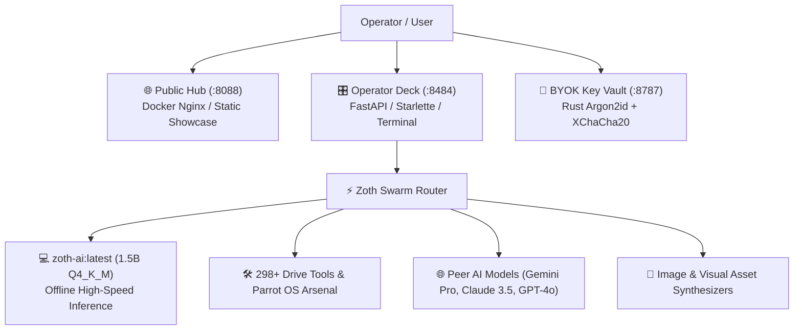

# ⚡ ZOTH STUDIO: Master Ecosystem & Architecture Documentation

> **Version**: 2.0.0 (Local AI & Swarm Router Release)  
> **Last Updated**: August 13, 2026  
> **Maintainer**: 757tech / Neal Frazier  
> **Stack**: Local Ollama (`zoth-ai:latest`), Starlette/Uvicorn, Three.js, Docker Nginx, Argon2id BYOK Vault, Tailwind/CSS  

---

## 🏛️ 1. Executive Summary & Ecosystem Architecture

Zoth Studio is a **local-first AI agent powerhouse**, website builder, and tool orchestration ecosystem. It avoids closed-source cloud SaaS lock-in by executing locally on your hardware.



---

## 🔌 2. Three-Tier Port & Network Topology

| Surface | Port / URL | Binding | Access Policy | Responsibility |
|---|---|---|---|---|
| **Public Hub** | `http://127.0.0.1:8088` | Loopback (`zoth-web` Docker) | Public / Cloudflare Tunnel | Static showcase, product story, pets hangar, SEO/AEO metadata |
| **Operator Deck** | `http://127.0.0.1:8484` | Loopback (`127.0.0.1`) | Private (Local Operator) | Agent execution, Pour site builder, Fusion Arena, 298-tool registry, terminal console |
| **BYOK Key Store** | `http://127.0.0.1:8787` | Loopback (`127.0.0.1`) | Private (Encrypted Daemon) | Hardware-isolated API key encryption at rest (Argon2id + XChaCha20-Poly1305) |

---

## 🤖 3. The Local AI Model (`zoth-ai:latest`)

`zoth-ai:latest` is a lightweight, zero-latency, local-first artificial intelligence built directly from the codebase.

### Model Specifications
- **Base Architecture**: Qwen2.5-Coder (`qwen2`)
- **Parameter Size**: 1.5 Billion Tensors (`1,536,416,256`)
- **Quantization**: GGUF `Q4_K_M` (4-Bit Medium Quantization)
- **Memory Footprint**: ~986 MB RAM
- **Context Window**: 32,768 tokens (1,536 embedding dimension)
- **License**: Apache 2.0 (100% Open Weights, locally verifiable)

### Model Verification & Cryptographic Hashes (SHA-256)
- **Training Dataset SHA-256**: `1a6803f15a58cdb2bd17446aa895f2324f959f176c4d96d8776ed0a994fa6b6a`
- **Modelfile Template SHA-256**: `b5968dd9fcc6d2b1a56920cfd867d888d5b419a12b378e791509088368ded954`

### Re-building & Re-training CLI
```bash
# 1. Synthesize dataset from latest pet doctrines & registry notes
python3 tools/build_zoth_model.py

# 2. Compile into Ollama
ollama create zoth-ai:latest -f Modelfile.zoth

# 3. Generate updated transparency report
python3 tools/generate_transparency_report.py
```

---

## 🔀 4. Multi-Agent Swarm Router & Tool Dispatcher

Located at [`studio-agents/zoth_router.py`](file:///media/neo/f2fdda77-178b-4603-ae80-c7aa4cd97908/13-creative-media/zoth/tools/null%20ai%20agent%20tools/local_null_ai_orchestrator/studio-agents/zoth_router.py), the swarm router classifies incoming intents and pairs local AI with specialized peer models:

1. **Local Code & Architecture** ➡️ Routed directly to `zoth-ai:latest`.
2. **Visual & Image Generation** ➡️ Routed to image synthesis pipeline.
3. **Deep Web Research & Literature** ➡️ Routed to research agents (Gemini Pro, Claude 3.5, arXiv/Europe PMC).
4. **Security Audits & Command Execution** ➡️ Routed to Parrot OS CLI & local orchestrator.

### Calling the Swarm API
```bash
curl -X POST http://127.0.0.1:8484/api/zoth/swarm \
  -H "Content-Type: application/json" \
  -d '{"prompt": "Audit OWASP vulnerabilities and generate a React 19 navbar", "pet_id": "lycan"}'
```

---

## 🐾 5. The 9 Cyber Pet Companions & Doctrines

| Companion | Type | Role | Primary Doctrine |
|---|---|---|---|
| 🤖 **Kai** | 3D Holographic Cat | Workspace Inspector | Smallest proof, zero drive-by refactors, rank findings by blast radius. |
| 🐉 **Draco** | 3D Cyber Dragon | Fusion Compiler | Agreement is evidence, conflict is a ticket. Produce single actionable plan. |
| 🔥 **Ignis** | 3D Neon Phoenix | Refactor & Ship | Turn red to green with smallest change. Dead weight elimination. |
| 🐺 **Lycan** | 3D Cybernetic Wolf | OWASP Sentinel | Defensive hardening, CSP enforcement, sanitization (DOMPurify). |
| 🦉 **Athena** | 3D Mecha Owl | Knowledge & AEO | Graph coherence, `/llms.txt` discovery optimization, machine schemas. |
| 🦊 **Kitsune** | 16-Bit Cyber Fox | Taste & Motion | Cyberpunk glassmorphism, responsive typography, micro-interactions. |
| 🐱 **Pixel-Neko** | 16-Bit Retro Cat | Tool Indexer | Continuous drive registry scanning and index maintenance. |
| 🐕 **Pixel-Shiba** | 16-Bit Cyber Doge | Vault Guardian | Local key isolation, loopback security, Argon2id daemon integrity. |
| 🎭 **Radical Minion** | Autonomous Hermes AI | Hermes Partner | Autonomous multi-step function calling & execution loops. |

---

## 📱 6. UI & Responsive Design System Standards

Both the Public Hub ([`public/index.html`](file:///media/neo/f2fdda77-178b-4603-ae80-c7aa4cd97908/13-creative-media/zoth/public/index.html)) and the Operator Deck ([`dashboard.html`](file:///media/neo/f2fdda77-178b-4603-ae80-c7aa4cd97908/13-creative-media/zoth/tools/null%20ai%20agent%20tools/local_null_ai_orchestrator/dashboard.html)) strictly follow the Zoth Design Philosophy:

- **Typography Scale**: Syne (Display Headlines) + Figtree/Inter (Body UI) + IBM Plex Mono / Fira Code (Technical Telemetry).
- **Aesthetic**: Futuristic glassmorphic surfaces (`backdrop-filter: blur(20px)`), refined cyan/synthwave accents, and zero textureless surfaces.
- **Desktop Layout**: 2-column & 3-column fluid grid systems with real-time telemetry HUDs, command palettes (`CMD + K`), and tranquil force graph visualizers.
- **Mobile Layout**: Responsive single-column fluid stacking, touch-friendly navigation pills, collapsible drawers, and zero horizontal overflow.
