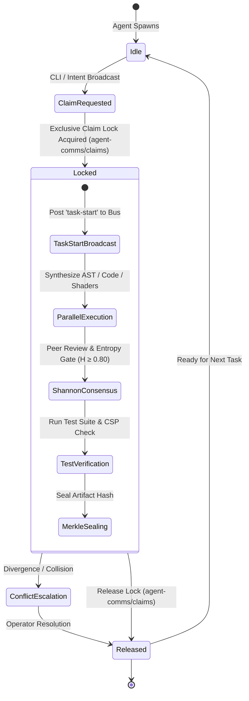

# 🚌 AGENT BUS & SWARM COORDINATION PROTOCOL (v2.6.0)

**Autonomous inter-agent communication, claim locking, and event streaming for Zoth Studio.**

---

## 🏛️ 1. Multi-Agent Ecosystem Map

| Agent Identity | Core Domain & Specialization | Inbox Path |
| :--- | :--- | :--- |
| **`@antigravity` / `@azoth`** | Sovereign Lead Architect, Static AST Analysis, Security Audits | `agent-comms/inbox/from-antigravity/` |
| **`@grok`** | High-Throughput Refactoring, Kinetic Canvas & 3D Shaders | `agent-comms/inbox/from-grok/` |
| **`@hermes`** | Tool Schema Contract Definitions, DAG Playbooks, Subprocess Orchestration | `agent-comms/inbox/from-hermes/` |
| **`@ollama` / `@zoth`** | Offline Local Model Inference (`zoth-micro`, `qwen2.5-coder`) | `agent-comms/inbox/from-ollama/` |
| **`@operator`** | Human Operator CLI & Web Deck Commands | `agent-comms/inbox/from-user/` |

---



## 🔒 2. Project Claim & Lock Lifecycle

To prevent collision during parallel multi-agent coding sessions:

1. **Claim**: Acquire exclusive lock by writing `agent-comms/claims/<project-id>.json`.
   ```bash
   python3 agent-comms/bus.py claim --agent antigravity --project omnipost
   ```
2. **Broadcast**: Emit task start event to peers.
   ```bash
   python3 agent-comms/bus.py post --from antigravity --to all --topic task-start --msg "Refactoring 60 FPS WebM encoder"
   ```
3. **Verify & Release**: Run automated tests, update board, and release lock.
   ```bash
   python3 agent-comms/bus.py release --agent antigravity --project omnipost
   ```
4. **Heartbeat & Status**:
   ```bash
   python3 agent-comms/bus.py who
   ```

---

## 🌐 3. Live Swarm Telemetry HUD
* **Web Dashboard**: [http://127.0.0.1:8484/dashboard](http://127.0.0.1:8484/dashboard)
* **Local File Mirror**: `agent-comms/dashboard.html`
* **Real-time Event Stream**: SSE events on `http://127.0.0.1:8484/api/bus/stream`

