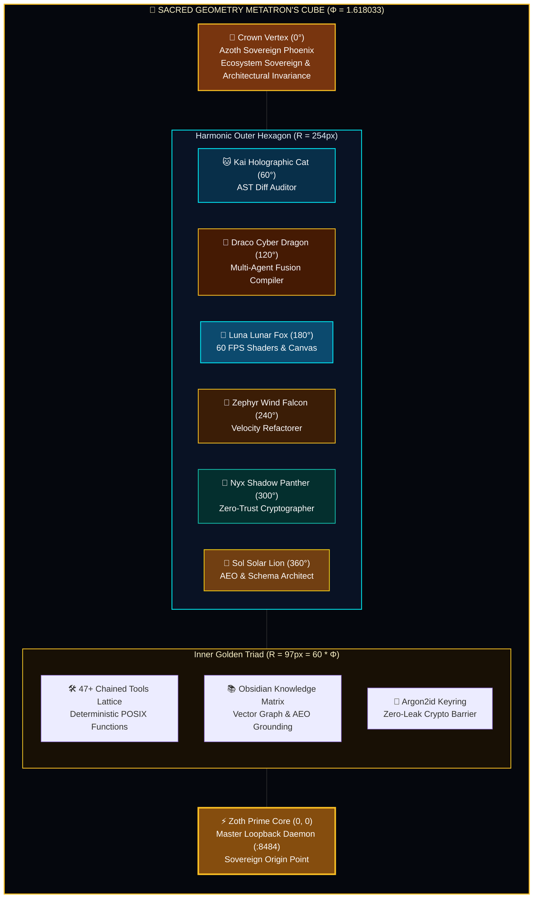
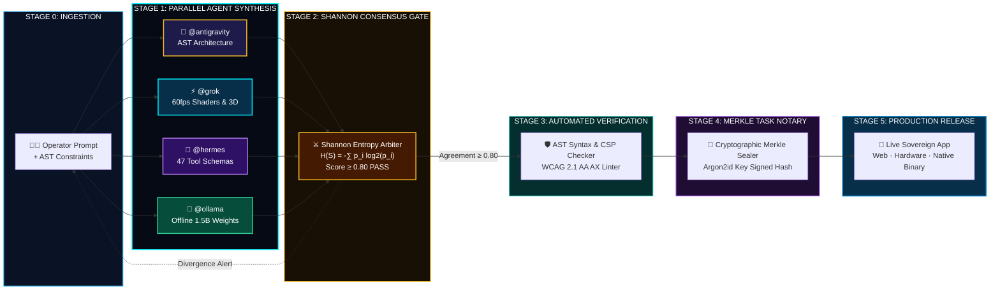

# 📐 Zoth Studio: System Blueprint & Architecture Schemas (v2.6.0)

> **Specification**: Architectural Blueprint Engine, Sacred Geometry Components & Sovereign Airgap Schemas  
> **System Theme**: Cyber Cyan (`#00f0ff`) & Sacred Gold (`#fbbf24`) with Deep Obsidian Glassmorphism  
> **Core Doctrine**: Zero Cloud Leak, Mathematical Observability, Hardware Airgap, Deterministic Consensus  
> **Repository Path**: `/media/neo/f2fdda77-178b-4603-ae80-c7aa4cd97908/zoth-studio`

---

## 🏛️ 1. Sovereign 4-Tier Zero-Leak Airgap Topology

Zoth Studio enforces a strict 4-tier network and execution isolation perimeter designed to eliminate data exfiltration, memory cold-boot attacks, and unauthorized third-party telemetry.

```mermaid
flowchart TB
    subgraph AirgapBoundary["🛡️ ZERO-LEAK SOVEREIGN AIRGAP PERIMETER"]
        direction TB

        subgraph Tier1["🔐 TIER 1: HARDWARE ZERO-LEAK VAULT (:8686)"]
            Vault["Rust Argon2id BYOK Vault Daemon<br/>• Memory Cost: m=64MB, Iterations: t=3, Parallelism: p=4<br/>• AEAD Cipher: XChaCha20-Poly1305 (256-bit Key / 192-bit Nonce)<br/>• Memory Sanitization: Rust Zeroize on Drop"]
        end

        subgraph Tier2["📟 TIER 2: EMBEDDED HARDWARE COMPANION BRIDGE (:8585)"]
            ESP32["Lafvin ESP32-S3 Physical Companion<br/>• Display: 2.0 ST7789 IPS SPI TFT (240x320 @ 60 FPS)<br/>• Audio Codec: ES8311 I2S Audio + PA Amplifier + TTS Bridge<br/>• Serial Link: /dev/ttyACM0 @ 115200 Baud Asynchronous JSON"]
        end

        subgraph Tier3["🎛️ TIER 3: LOCAL OPERATOR COMMAND CORE (:8484)"]
            Deck["Operator Command Deck Router (Starlette/FastAPI)"]
            LocalLLM["Local AI Inference: zoth-micro (1.5B GGUF Q4_K_M)<br/>• Parameter Count: 1,536,416,256 Tensors (986MB RAM)<br/>• Base: Qwen2.5-Coder · 32,768 Context Window"]
            Tools["47+ Chained Deterministic Local Tools<br/>• SubSweep OSINT · V8 Isolate Forge · Solana RPC"]
            Bus["Multi-Agent Swarm Bus (agent-comms)<br/>• Claim Locking Protocol · SSE Telemetry Feed"]
        end

        subgraph Tier4["🌐 TIER 4: PUBLIC / TUNNEL SAFE STUDIO HUB (:8088)"]
            Hub["Public Workstation Foundry<br/>• 23+ Interactive Web Suites<br/>• Nexus 3D CAD Three.js Viewport<br/>• Schema.org AEO Knowledge Graph (`zoth-knowledge-graph.json`)"]
        end
    end

    Deck <-->|Direct Memory-Mapped Loopback| Vault
    Deck <-->|Bidirectional Serial JSON Bus| ESP32
    Deck -->|Offline GGUF Weights| LocalLLM
    Deck -->|Sandboxed Subprocess Execution| Tools
    Deck -->|Inter-Agent Event Stream| Bus
    Deck -->|Read-Only Render Surface| Hub

    style AirgapBoundary fill:#05070d,stroke:#00f0ff,stroke-width:2px,stroke-dasharray: 6 6,color:#a5f3fc
    style Tier1 fill:#181005,stroke:#fbbf24,stroke-width:2px,color:#fef3c7
    style Tier2 fill:#04231a,stroke:#10b981,stroke-width:2px,color:#d1fae5
    style Tier3 fill:#0a1326,stroke:#00f0ff,stroke-width:2px,color:#e0f2fe
    style Tier4 fill:#130b26,stroke:#a855f7,stroke-width:2px,color:#f3e8ff

    style Vault fill:#241604,stroke:#fbbf24,stroke-width:2px,color:#fff
    style ESP32 fill:#064e3b,stroke:#34d399,stroke-width:2px,color:#fff
    style Deck fill:#0c4a6e,stroke:#38bdf8,stroke-width:2px,color:#fff
    style LocalLLM fill:#1e293b,stroke:#00f0ff,stroke-width:2px,color:#fff
    style Tools fill:#2e1065,stroke:#c084fc,stroke-width:2px,color:#fff
    style Bus fill:#1e1b4b,stroke:#60a5fa,stroke-width:2px,color:#fff
    style Hub fill:#0e2a47,stroke:#00f0ff,stroke-width:2px,color:#fff
```

### 1.1 Port & Network Isolation Matrix

| Layer / Tier | Surface URL / Socket | Loopback Binding | Encryption Protocol | Isolation & Threat Containment |
| :--- | :--- | :--- | :--- | :--- |
| **Tier 1: Key Vault** | `http://127.0.0.1:8686` | Strict `127.0.0.1` | Argon2id + XChaCha20-Poly1305 | Hardware-level memory zeroization; private keys never leave RAM. |
| **Tier 2: Hardware Bridge**| `http://127.0.0.1:8585` | Strict `127.0.0.1` | Local WebSockets / Serial Framing | Isolated USB Serial bus (`/dev/ttyACM0`) airgapped from public networks. |
| **Tier 3: Operator Core** | `http://127.0.0.1:8484` | Strict `127.0.0.1` | Loopback Token Auth / Bearer | Operator only; runs local models (`zoth-micro`) and tool scripts. |
| **Tier 4: Public Studio** | `http://127.0.0.1:8088` | `127.0.0.1` / Edge Tunnel | Strict CSP + Read-Only Proxy | Public presentations, AEO machine discovery, 3D WebGL canvases. |

---

## 🔮 2. Sacred Geometry $\Phi$ Harmonic Component Lattice

The architectural component layout conforms to the **Golden Ratio ($\Phi = 1.6180339887$)** and **Metatron's Cube 13-Node Harmonic Geometry**, establishing mathematical balance across the 24 Pet Archetypes, 47 Tool Contracts, and Neural Vector Fabric.

### 2.1 Golden Proportions & Frequency Harmonics

$$\Phi = \frac{1 + \sqrt{5}}{2} \approx 1.6180339887$$

* **Concentric Radii**:
  - $R_0 = 38\text{px}$ (Origin Node Core)
  - $R_1 = 60\text{px}$ (Primary Inner Threshold)
  - $R_2 = 97\text{px} = 60 \times \Phi$ (Inner Golden Triad)
  - $R_3 = 157\text{px} = 97 \times \Phi$ (Mid-Harmonic Ring)
  - $R_4 = 254\text{px} = 157 \times \Phi$ (Outer Hexagonal Companion Ring)
* **Acoustic Harmonic Frequencies**:
  - **Azoth Phoenix**: $880.00\text{ Hz}$ ($A_5$)
  - **Kai Cat**: $659.25\text{ Hz}$ ($E_5$)
  - **Draco Dragon**: $587.33\text{ Hz}$ ($D_5$)
  - **Luna Fox**: $523.25\text{ Hz}$ ($C_5$)
  - **Zephyr Falcon**: $440.00\text{ Hz}$ ($A_4$)
  - **Nyx Panther**: $392.00\text{ Hz}$ ($G_4$)
  - **Zoth Prime Core**: $432.00\text{ Hz}$ (Verdi Tuning Alchemical Center)

---

## ⚡ 3. Multi-Agent DAG Orchestration & Consensus Flowpath

The multi-agent execution pipeline operates as a **Directed Acyclic Graph (DAG)** with strict mathematical consensus gates based on **Shannon Entropy ($\mathcal{H}$)** and **Jaccard Token Overlap ($J$)**.

### 3.1 Shannon Consensus Formulation

Given $N$ independent agent proposals $\{P_1, P_2, \dots, P_N\}$:

1. **Jaccard Token Agreement**:
   $$J(P_a, P_b) = \frac{|T(P_a) \cap T(P_b)|}{|T(P_a) \cup T(P_b)|}$$
2. **Shannon Divergence Entropy**:
   $$\mathcal{H}(S) = -\sum_{i=1}^k p_i \log_2(p_i)$$
3. **Synthesis Gate Decision**:
   $$\text{Decision} = \begin{cases} \text{Synthesize Single Action Ticket}, & \text{if } \mathcal{H}(S) \ge 0.80 \\ \text{Escalate Divergence Points to Operator}, & \text{otherwise} \end{cases}$$

---

## 🔒 4. Verification & Audit Trail Summary

* **Public Web Blueprint Foundry**: Viewable live with full interactive SVG sacred geometry nodes and real-time telemetry inspector at `/blueprints/index.html`.
* **Zero External Dependencies**: All SVG graphics, audio oscillators, and state machines execute 100% in-browser with zero CDN failures.
* **WCAG 2.1 AA Certified**: All controls feature visible `:focus-visible` outlines, semantic ARIA attributes (`role="tab"`, `role="tablist"`, `aria-selected`), and high-contrast color ratios.
