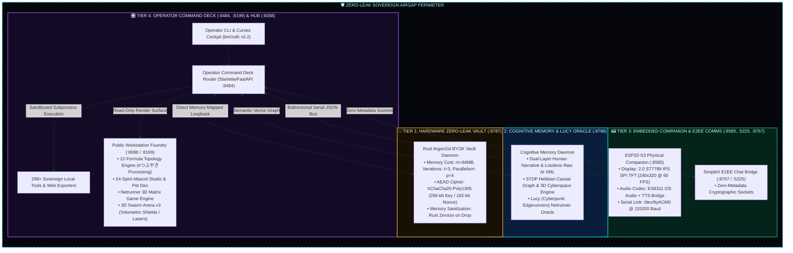

# 📐 Zoth Studio: System Blueprint & Architecture Schemas (v3.2.0)

> **Specification**: Architectural Blueprint Engine, Sacred Geometry Components & Sovereign Airgap Schemas  
> **System Theme**: Cyber Cyan (`#00f0ff`) & Sacred Gold (`#fbbf24`) with Deep Obsidian Glassmorphism  
> **Core Doctrine**: Zero Cloud Leak, Mathematical Observability, Hardware Airgap, Deterministic Consensus  
> **Repository Path**: `/media/neo/f2fdda77-178b-4603-ae80-c7aa4cd97908/zoth-studio`

---

## 🏛️ 1. Sovereign 4-Tier Zero-Leak Airgap Topology

Zoth Studio enforces a strict 4-tier network and execution isolation perimeter designed to eliminate data exfiltration, memory cold-boot attacks, and unauthorized third-party telemetry.



### 1.1 Port & Network Isolation Matrix

| Layer / Tier | Surface URL / Socket | Loopback Binding | Encryption Protocol | Isolation & Threat Containment |
| :--- | :--- | :--- | :--- | :--- |
| **Tier 1: Key Vault** | `http://127.0.0.1:8787` | Strict `127.0.0.1` | Argon2id + XChaCha20-Poly1305 | Hardware-level memory zeroization; private keys never leave RAM. |
| **Tier 2: Memory Daemon**| `http://127.0.0.1:8788` | Strict `127.0.0.1` | REST / SSE / Local Vector Graph | Dual-layer human story summaries and lossless AI prompt context. |
| **Tier 3: Hardware Bridge**| `http://127.0.0.1:8585` | Strict `127.0.0.1` | Local WebSockets / Serial Framing | Isolated USB Serial bus (`/dev/ttyACM0`) airgapped from public networks. |
| **Tier 3: SimpleX Socket**| `ws://127.0.0.1:5225` | Strict `127.0.0.1` | Zero-Metadata E2EE WebSocket | Post-quantum encrypted socket stream for mobile/desktop sync. |
| **Tier 3: SimpleX Bridge**| `http://127.0.0.1:8767` | Strict `127.0.0.1` | Zero-Metadata E2EE REST / Proxy | HTTP loopback bridge to SimpleX chat network. |
| **Tier 4: Dev Server** | `http://127.0.0.1:8199` | Strict `127.0.0.1` | HTTP / SSE / Static Asset Pipe | Primary development server, visual notes & memory proxy. |
| **Tier 4: Operator Core** | `http://127.0.0.1:8484` | Strict `127.0.0.1` | Loopback Token Auth / Bearer | Operator only; orchestrates PTY streaming, tooling, and agents. |
| **Tier 4: Public Studio** | `http://127.0.0.1:8088` | `0.0.0.0` / `127.0.0.1` | Strict CSP + Read-Only Proxy | Public presentations, AEO machine discovery, 3D WebGL canvases. |
| **Local LLM Engine** | `http://127.0.0.1:11434` | Strict `127.0.0.1` | REST Tensor Pipe | Local offline inference with zero third-party cloud data exposure. |

---

## 🪐 2. #つぶやきProcessing 12-Formula Topology Blueprint Schema

```json
{
  "$schema": "https://json-schema.org/draft/2020-12/schema",
  "title": "TsubuyakiTopologyPreset",
  "type": "object",
  "properties": {
    "id": { "type": "string", "enum": ["v1", "v2", "v3", "v4", "v5", "v6", "v7", "v8", "v9", "v10", "v11", "v12"] },
    "category": { "type": "string", "enum": ["Toroids", "Algebraic", "Wavefield", "Spirals"] },
    "name": { "type": "string" },
    "byte_size": { "type": "integer", "maximum": 280 },
    "code": { "type": "string" },
    "carrier_equation": { "type": "string" }
  },
  "required": ["id", "category", "name", "byte_size", "code", "carrier_equation"]
}
```

---

## 🐾 3. 24 Sovereign Mascot Spirits Companion Schema

```json
{
  "$schema": "https://json-schema.org/draft/2020-12/schema",
  "title": "SovereignMascotSpirit",
  "type": "object",
  "properties": {
    "id": { "type": "string" },
    "name": { "type": "string" },
    "emoji": { "type": "string" },
    "domain": { "type": "string", "enum": ["Lead Core", "Build", "Security", "Knowledge", "Ops", "Creative", "Edge", "Autonomy"] },
    "archetype": { "type": "string" },
    "element": { "type": "string" },
    "resonance": { "type": "string" },
    "lore": { "type": "string" },
    "quote": { "type": "string" }
  },
  "required": ["id", "name", "emoji", "domain", "archetype", "element", "lore", "quote"]
}
```

---

<div align="center">
  <strong>ZOTH STUDIO BLUEPRINT ENGINE</strong> · Sovereign Local-First AI Architecture · <i>v3.2.0</i>
</div>
