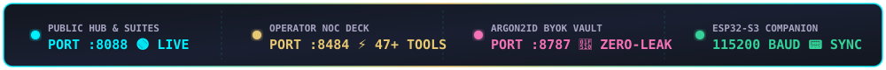
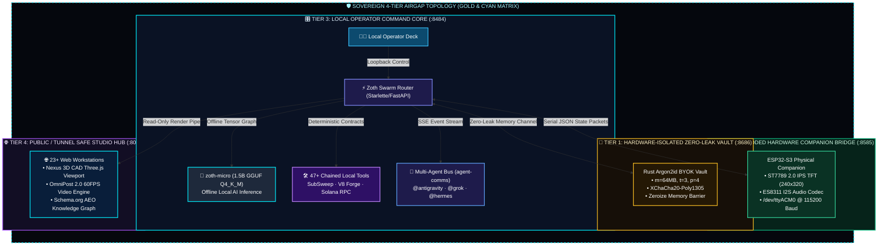
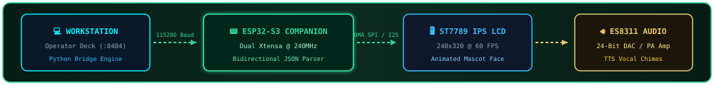

#  ⚡ ZOTH STUDIO MASTER DOCUMENTATION (v2.6.0)

### *Sovereign Local-First AI Agent Powerhouse, 3D CAD Omniverse & Hardware Companion Architecture*

 

<!-- Live Animated Telemetry HUD -->

  

##  🏛️ 1. Executive Summary & Four-Tier Architecture

**Zoth Studio** is an autonomous, sovereign local-first AI agent powerhouse, 3D CAD engine, multi-agent arbitration deck, and physical hardware companion hub. Operating entirely from local storage, it delivers zero-leak privacy, instant local execution, and total resilience against cloud SaaS vendor lock-in.

##  ⚡ 2. 21-Agent Autonomous Pantheon

  

* **Master Azoth**: Supreme lead sovereign architect, Fibonacci geometry enforcer, and AST synthesis core.
* **Antigravity (Google Deepmind AGY)**: Test-first diff generation and zero-drive-by refactor audits.
* **Grok (xAI)**: Real-time telemetry monitoring, deep code auditing, and security fuzzing.
* **Hermes 3 (Nous Research)**: Autonomous multi-step tool caller and recursive task planner.
* **Draco**: Multi-Agent AST compiler turning cross-agent conflicts into unified PRs.
* **Lycan**: OWASP defense sentinel, DOMPurify sanitizer, and strict CSP guard.

##  📟 3. Hardware Dataflow & Protocol

  

* **Microcontroller**: Dual-Core Xtensa LX7 @ 240MHz, 16MB Flash, 8MB PSRAM.
* **ST7789 Display**: 2.0" IPS LCD at 240x320 resolution with 60 FPS DMA SPI rendering.
* **ES8311 Audio Codec**: 24-bit I2S audio DAC powering onboard speaker for TTS voice chimes.
* **Serial Protocol**: Bidirectional 115200 baud JSON protocol exchanging companion state and button triggers.

---

  
   
  <strong>Zoth Studio Technical Architecture Committee</strong> · Licensed under Apache License 2.0

