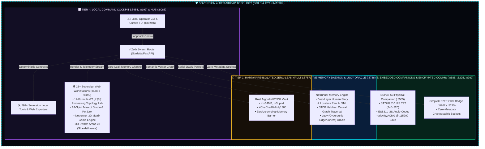

#  ⚡ ZOTH STUDIO MASTER DOCUMENTATION (v3.2.0)

### *Sovereign Local-First AI Agent Powerhouse, 3D Omniverse, Netrunner Cyberspace, 12-Formula Topology Engine & Cryptographic Key Vault*

 

<!-- Live Animated Telemetry HUD -->

  

## 🏛️ 1. Executive Summary & Four-Tier Sovereign Architecture

**Zoth Studio** is an autonomous, sovereign local-first AI agent powerhouse, 3D CAD omniverse, multi-agent arbitration deck, cognitive memory daemon, and physical hardware companion hub. Operating entirely from local storage, it delivers zero-leak privacy, instant local execution, and total resilience against cloud SaaS vendor lock-in.

## 🌐 2. Universal Port & Protocol Architecture

| Service / Workstation | Port | Loopback Binding | Encryption / Protocol | Purpose |
| :--- | :---: | :--- | :--- | :--- |
| **Zoth Dev Server** | `8199` | `127.0.0.1` (Local) | HTTP / SSE / Static | Primary development server, visual notes & memory proxy |
| **Zoth Studio Hub** | `8088` | `0.0.0.0` / `127.0.0.1` | HTTP / SSE / WebGL | 23+ Flagship workstations, 3D scenes, WebGen, vOS sandbox |
| **Master Orchestrator Deck** | `8484` | `127.0.0.1` (Local) | Token Auth / REST / PTY | Operator command center, PTY streaming, task dispatch |
| **Rust Argon2id Key Vault** | `8787` | `127.0.0.1` (Local) | Argon2id + XChaCha20-Poly1305 | Hardware-isolated BYOK key storage with Zeroize-on-drop |
| **Cognitive Memory Daemon** | `8788` | `127.0.0.1` (Local) | REST / SSE / Vector Graph | Dual-layer memories, STDP Hebbian graph, Lucy 3D cyberspace |
| **SimpleX WebSocket Relay** | `5225` | `127.0.0.1` (Local) | WebSocket JSON-RPC | Real-time post-quantum chat socket for agent coordination |
| **SimpleX E2EE Web Bridge** | `8767` | `127.0.0.1` (Local) | Zero-Metadata E2EE / REST | HTTP loopback bridge to SimpleX chat network |
| **ESP32-S3 Hardware Bridge**| `8585` | `127.0.0.1` (Local) | Serial JSON framing | USB `/dev/ttyACM0` companion telemetry & button triggers |
| **Ollama Local AI Server** | `11434` | `127.0.0.1` (Local) | REST Tensor Pipe | Local offline LLM inference (Llama, DeepSeek, Qwen) |

## ⚡ 3. 21-Agent Autonomous Pantheon & 24 Mascot Spirits

  

### The 21 Pantheon Sovereign AI Agents:
* **Master Azoth**: Supreme lead sovereign architect, Fibonacci geometry enforcer, and AST synthesis core.
* **Lucy (Cyberpunk: Edgerunners)**: Lead Netrunner Oracle, neural context curator, and deep-dive memory indexer.
* **Antigravity (Google Deepmind AGY)**: Test-first diff generation, multi-step code pairing, and zero-drive-by refactor audits.
* **Grok (xAI)**: Real-time telemetry monitoring, deep code auditing, and security fuzzing.
* **Hermes 3 (Nous Research)**: Autonomous multi-step tool caller and recursive task planner.
* **Draco**: Multi-Agent AST compiler turning cross-agent conflicts into unified PRs.
* **Lycan**: OWASP defense sentinel, DOMPurify sanitizer, and strict CSP guard.
* **Athena**: Knowledge graph validator and AEO Schema.org architect.
* **Kitsune**: Creative motion, cyber dark taste, and visual synthesis.
* **Aether, Ignis, Chronos, Ghostbyte, Kraken, Leviathan, Scorpius, Onyx, Radical Minion, Pixel Shiba, Pixel Neko, Aquila**.

### The 24 Mascot Spirits & Pet Dex:
Full list accessible in CLI (`zoth pet list`), terminal companion simulator (`zoth pet play`), and web studio ([`/pets/`](http://127.0.0.1:8088/pets/)):
* `azoth`, `zoth`, `kai`, `draco`, `ignis`, `lycan`, `athena`, `kitsune`, `pixel-neko`, `pixel-shiba`, `radical-minion`, `glitchcat`, `circuit-pup`, `terminal-ghost`, `savage-codex`, `ai-workbot`, `binary`, `aquila`, `leviathan`, `onyx`, `chronos`, `aether`, `kraken`, `scorpius`.

## 🪐 4. #つぶやきProcessing 12-Formula Topology Engine

All 12 topological mathematical formulas are golfed into 280-byte tweetable code and computed in real-time in terminal ASCII (`zoth tsubuyaki render`) and 3D WebGPU ([`/showcase/tsubuyaki-vortex.html`](http://127.0.0.1:8199/showcase/tsubuyaki-vortex.html)):

1. **`v1` Celestial Torus Vortex** (222 B): Twin-strand counter-rotating torus with singular harmonic ripples $\sin(9/k)$.
2. **`v2` Hexa-Strand Möbius Vortex** (245 B): 6-fold phase-split ribbon knot with cubic wave surges $d^3/9$.
3. **`v3` Triskelion Crystalline Knot** (239 B): 3-lobed trifold rotation with parabolic ripple surface.
4. **`v4` Hyperbolic Gyroid Mesh** (242 B): 4-fold interwoven saddle geometry with hyperbolic warping.
5. **`v5` Folium of Descartes Loop** (209 B): Classical algebraic folium nodal loop.
6. **`v6` Acos Wave Collapse Toroid** (218 B): Piecewise wave collapse with $\cos(5 - \arccos(\cos(3p)))99$.
7. **`v7` Polar Cassini Oval Resonator** (224 B): Bi-focal orbital modulation and harmonic lobes.
8. **`v8` Order/Disorder Interference** (231 B): 2D lattice stipple field with radial interference ripples.
9. **`v9` Polar Modulo Lissajous** (228 B): Multi-harmonic resonance rings woven by co-varying frequency phase modulations.
10. **`v10` Clifford Strange Attractor** (248 B): Fractal chaotic flow attractor with phase oscillations.
11. **`v11` Logarithmic Golden Spiral** (214 B): $(1.0008)^y$ exponential phyllotaxis spiral.
12. **`v12` Quantum Fermat Phyllotaxis** (238 B): $\sqrt{i}\cdot 2.2$ density grain packing with quantum spin warp.

## 🎮 5. First-Person 3D Video Game Matrix Engine & Lucy Oracle

The Netrunner Memory Hub (`:8788` / [`/studio/netrunner-memory.html`](http://127.0.0.1:8088/studio/netrunner-memory.html)) transforms abstract memory recall into a 3D Cyberpunk video game world:
* **Stepped Alchemical Altars**: Hexagonal stone & glowing cyan platforms with animated perimeter energy tracks.
* **Faceted Iridescent Shards**: 3D crystalline memory nodes with dual counter-rotating octahedral cores.
* **Lucy (Cyberpunk: Edgerunners) Oracle**: Authentic Lucy avatar billboard with holographic scanlines, radiant energy bursts, and interactive voice synthesis.
* **In-World Spatial Billboard UI**: HTML5 3D Canvas textures displaying live memory titles, timestamps, and STDP resonance scores floating above each node.
* **360° Circular Radar Mini-Map**: Top-down heads-up radar showing nearby memory shards and player coordinates.
* **`[TAB]` Netrunner AR Scanner**: Cyberpunk analytical scan mode revealing hidden STDP synaptic connections.

## 📐 6. Mathematical Pillars of Sovereign AI (Theory Academy)

The entire Zoth Studio multi-agent consensus, arbitration, and vector memory matrix is anchored in six formal mathematical disciplines accessible through the interactive [`/studio/math-pillars.html`](http://127.0.0.1:8088/studio/math-pillars.html) academy:

### Pillar I: Monoidal Category Theory & Sheaf Cohomology
* **Categorical Functor Composition**: Agent tool pipelines are modeled as functors $F: \mathcal{C} \to \mathcal{D}$ between symmetric monoidal categories. Side effects are strictly confined to an IO Monad $(T, \eta, \mu)$.
* **Sheaf Cohomology on Swarm Graphs**: When agents propose conflicting code modifications, local AST consistency is measured as sections over open coverings $\mathcal{U} = \{U_i\}$. A global merge exists if and only if the first Čech cohomology group vanishes:
  $$\check{H}^1(\mathcal{U}, \mathcal{F}) = 0$$

### Pillar II: High-Dimensional Information Geometry & Riemannian Manifolds
* **Fisher Information Metric Tensor**: The probability simplex of agent actions is endowed with the Riemannian metric:
  $$g_{ij}(\theta) = \int p(x; \theta) \frac{\partial \log p(x; \theta)}{\partial \theta_i} \frac{\partial \log p(x; \theta)}{\partial \theta_j} dx$$
* **Natural Gradient Optimization**: Ensures invariant step lengths across different parameter scales:
  $$\tilde{\nabla} L(\theta) = g^{-1}(\theta) \nabla L(\theta)$$
* **Poincaré Hyperbolic Embeddings**: Memory and file hierarchies are mapped to the hyperbolic disk $\mathbb{D}^n$, preserving exponential tree branching without metric distortion.

### Pillar III: Spike-Timing-Dependent Plasticity (STDP) & Synaptic Hebbian Graph
* **Synaptic Weight Plasticity**: Links between memory nodes are formed dynamically based on causal execution timing differences $\Delta t = t_{\text{effect}} - t_{\text{cause}}$:
  $$\Delta w = \begin{cases} A_+ e^{-\Delta t / \tau_+} & \Delta t > 0 \text{ (Long-Term Potentiation)} \\ -A_- e^{\Delta t / \tau_-} & \Delta t < 0 \text{ (Long-Term Depression)} \end{cases}$$
* **Causal Root-Cause Discovery**: Enables `/v1/memories/causal-path` to traverse the directed graph in sub-millisecond latency to locate the exact commit or prompt that induced a bug.

### Pillar IV: Shannon Agreement Entropy & Epistemic Triangulation
* **Consensus Disagreement Entropy**: Quantifies uncertainty across multi-model arbitration (Antigravity, Grok, Hermes):
  $$H(P) = -\sum_{i=1}^N p_i \log_2 p_i$$
* **Automatic Commit Gate**: Execution proceeds autonomously only when $H(P) < 0.20\text{ bits}$, preventing divergent or unverified code writes.

### Pillar V: Kolmogorov-Arnold Networks (KAN) & Learnable B-Splines
* **Symbolic Representation**: Replaces black-box MLP matrix multiplications with parameterized 1D B-spline curves along graph edges:
  $$f(x_1, \dots, x_n) = \sum_{q=1}^{2n+1} \Phi_q\left( \sum_{p=1}^n \phi_{q,p}(x_p) \right)$$
* **Zero-Hallucination Equation Extraction**: Produces exact closed-form algebraic expressions explaining agent reasoning patterns.

### Pillar VI: Modern Continuous Hopfield Networks for Dense Associative Memory
* **Energy Minimization**: Provides exponential pattern capacity ($C \sim 2^{d/2}$) for instant episodic memory recall:
  $$E(x) = -\beta^{-1} \text{LSE}(\beta, X^T x) + \frac{1}{2} x^T x$$
* **Subconscious Associative Recall**: Guarantees single-iteration retrieval of closest historical context matching current prompt embeddings.

---

  
   
  <strong>Zoth Studio Technical Architecture Committee</strong> · Licensed under MIT / Apache-2.0

