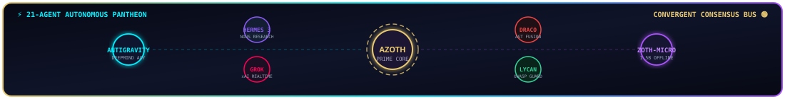
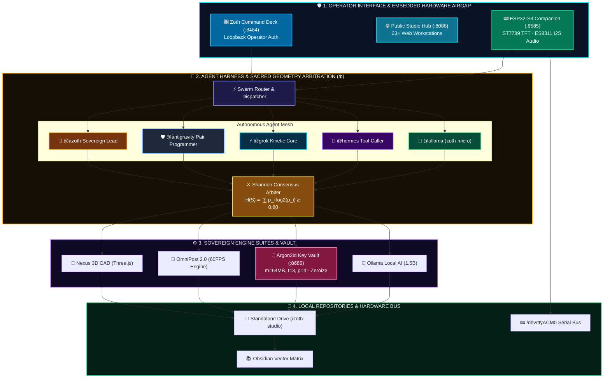

#  🏗️ Zoth Studio Architecture & Logic Blueprint (v2.6.0)

### *Technical Specification: Multi-Agent Consensus, Three.js CAD Viewport, ESP32-S3 Serial Protocols & Argon2id BYOK Vault*

 

  

## 🧩 System Architecture Overview

Zoth Studio utilizes a four-tier sovereign architecture designed for high-concurrency local execution:

## 🤖 1. Multi-Agent Arbitration & Consensus Logic

### Consensus Loop & Mathematical Formulation:
1. **Multi-Agent Prompt Ingestion**: Operator prompt is broadcast to peer models.
2. **Token Overlap & Shannon Agreement Entropy**:
   $$\mathcal{H}(S) = -\sum_{i=1}^n p_i \log_2(p_i)$$
   Measures divergence across proposed implementation plans.
3. **Consensus Arbiter**: If agreement score $\ge 0.80$, synthesizes a single unified action ticket; if conflict arises, flags divergence points for operator review.
4. **Self-Correction & Build Validation**: Pre-validates syntax, runs automated endpoint tests, and audits security headers before final write.

---

## 📟 2. ESP32-S3 Hardware Companion Protocol
* **Serial Baud**: `115200` baud over USB `/dev/ttyACM0`
* **JSON State Machine**: Bi-directional asynchronous packets syncing companion mood, CPU load, active agent, and button triggers.
* **Audio Synthesis**: Local TTS bridge (`tts_bridge.py`) converting agent messages to speech streamed via ES8311 I2S PA amplifier.

---

## 🔐 3. Rust Argon2id BYOK Key Vault Logic
* **Parameters**: Argon2id memory cost $m=64\text{MB}$, iterations $t=3$, parallelism $p=4$.
* **Cipher**: XChaCha20-Poly1305 with 256-bit key and 192-bit nonce.
* **Buffer Sanitization**: Rust `zeroize` guarantees private key buffers in RAM are overwritten with zeroes upon scope termination.

---

  
   
  <strong>Zoth Studio Architecture & Logic</strong> · Licensed under Apache License 2.0

