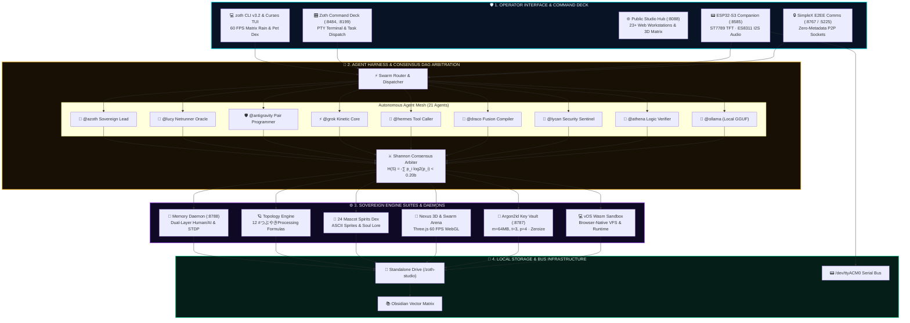

#  🏗️ Zoth Studio Architecture & Logic Blueprint (v3.2.0)

### *Technical Specification: Multi-Agent Consensus, 3D Cyberspace Engine, 12-Formula Topologies, 24 Mascot Spirits, STDP Memory & Argon2id Vault*

 

  

## 🧩 System Architecture Overview

Zoth Studio utilizes a four-tier sovereign architecture designed for high-concurrency local execution:

## 🤖 1. Multi-Agent Arbitration & Consensus Logic

### Consensus Loop & Mathematical Formulation:
1. **Multi-Agent Prompt Ingestion**: Operator prompt is broadcast to peer models.
2. **Shannon Agreement Entropy**:
   $$\mathcal{H}(S) = -\sum_{i=1}^n p_i \log_2(p_i)$$
   Measures divergence across proposed AST modification plans.
3. **Consensus Arbiter**: When $\mathcal{H}(S) < 0.20\text{ bits}$, synthesizes a single unified action plan; if conflicts emerge, flags divergence points for operator review.
4. **Self-Correction & AST Validation**: Draco and Lycan compile AST invariants and audit OWASP security bounds before executing code writes.

---

## 🪐 2. #つぶやきProcessing 12-Formula Topology Engine
* **280-Byte Tweetable Constraints**: Formulated in pure golfed JavaScript and rendered in terminal ASCII via `zoth tsubuyaki render` and in 3D WebGPU via [`/showcase/tsubuyaki-vortex.html`](http://127.0.0.1:8199/showcase/tsubuyaki-vortex.html).
* **Mathematical Families**: Toroids (`v1`–`v4`), Algebraic Curves (`v5`–`v7`), Wavefields (`v8`–`v10`), and Spirals (`v11`–`v12`).

---

## 🐾 3. 24 Sovereign Mascot Spirits & Pet Dex System
* **Alchemical Companions**: 24 familiars binding domain expertise across Lead Core, Build, Security, Knowledge, Ops, Creative, Edge, and Autonomy.
* **CLI Interactivity**: Real-time multi-frame ASCII sprite animation (`zoth pet ascii`), companion status and tamagotchi interaction (`zoth pet play`), and session binding (`zoth pet summon`).

---

## 🧠 4. Cognitive Memory & Netrunner Cyberspace Engine (`:8788`)
* **Dual-Layer Architecture**: Narrative human story digest for clean operator review alongside lossless raw payload XML block for direct AI context injection.
* **STDP Hebbian Graph Traversal**: Bidirectional `before_ids` and `after_ids` synaptic links calculate weighted temporal causality for deep multi-hop reasoning.
* **First-Person 3D Video Game Matrix**: Stepped hexagonal altars, faceted iridescent shards, Lucy (Cyberpunk: Edgerunners) oracle billboard, 360° circular radar, and `[TAB]` AR scanner mode.

---

## 📟 5. ESP32-S3 Hardware Companion Protocol (`:8585`)
* **Serial Baud**: `115200` baud over USB `/dev/ttyACM0`
* **JSON State Machine**: Bi-directional asynchronous packets syncing companion mood, CPU load, active agent, and button triggers.
* **Audio Synthesis**: Local TTS bridge converting agent messages to speech streamed via ES8311 I2S PA amplifier.

---

## 🔐 6. Rust Argon2id BYOK Key Vault Logic (`:8787`)
* **Parameters**: Argon2id memory cost $m=64\text{MB}$, iterations $t=3$, parallelism $p=4$.
* **Cipher**: XChaCha20-Poly1305 with 256-bit key and 192-bit nonce.
* **Buffer Sanitization**: Rust `zeroize` guarantees private key buffers in RAM are overwritten with zeroes upon scope termination.

---

  
   
  <strong>Zoth Studio Architecture & Logic Committee</strong> · Licensed under MIT / Apache-2.0

