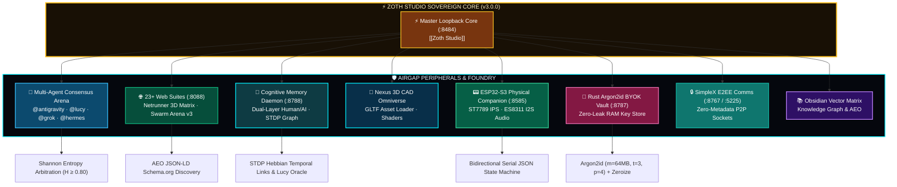

# ⚡ ZOTH STUDIO (v3.0.0): Sovereign Local-First AI Agent Powerhouse & Hardware Hub

![[Assets/videos/zoth-studio-hero.mp4]]

> [!FIRE] APEX FLAGSHIP SOVEREIGN HUB
> **Zoth Studio (v3.0.0)** is the sovereign flagship AI system powering our software and hardware ecosystem. It integrates a **Local-First Multi-Agent Swarm Deck**, a **Netrunner Memory Hub 3D Cyberspace Engine**, a **Three.js Nexus 3D CAD Omniverse**, a **3D Swarm Arena v3**, an **ESP32-S3 Physical Companion**, and an **Argon2id BYOK Zero-Leak Vault**.

> [!NOTE] Standalone Drive Root Architecture
> Zoth Studio operates directly from the standalone top-level root `/media/neo/f2fdda77-178b-4603-ae80-c7aa4cd97908/zoth-studio`, orchestrating 23+ web suites, background daemons, and all 15 project categories.

---

## 🏛️ Strategic Core Pillars & Architecture

---

## 🤖 1. Powerhouse AI Agent Harness & Swarm Arbitration
* **Swarm Arbitration Engine**: Autonomous 3-agent arbitration calculating Shannon agreement entropy and Jaccard token overlap metrics.
* **Azoth Sovereign Persona**: Lead pair programmer and system architect configured for Parrot OS local-first execution.
* **Lucy (Cyberpunk: Edgerunners)**: Netrunner memory oracle analyzing semantic vector clusters and neural context streams.
* **Ollama Local Intelligence**: Offline local model weights (`zoth-micro`, `qwen2.5-coder`, `hermes-3`) with transparent tensor inspection.

---

## 🧠 2. Netrunner Memory Hub & 3D Cyberspace Engine (`:8788`)
* **Dual-Layer Memory Pipeline**: Human narrative digest alongside lossless raw XML for AI prompt contexts.
* **First-Person 3D Game World**: Stepped hexagonal altars, faceted crystals with counter-rotating cores, 360° circular radar, and `[TAB]` AR scanner.
* **Lucy Oracle Node**: Authentic Cyberpunk Edgerunners avatar billboard with radiant light bursts and TTS narration.

---

## 🧊 3. Nexus 3D Omniverse & Swarm Arena v3
* **Three.js CAD Viewport**: Real-time GLTF/OBJ asset inspector, wireframe/PBR/point cloud modes, HDRI lighting rigs, and transform gizmos.
* **3D Swarm Arena v3**: Volumetric energy shields, kinetic thruster particle trails, and multi-tier particle laser beam combat visualization.

---

## 📟 4. ESP32-S3 Physical Hardware Companion (`:8585`)
* **Lafvin ESP32-S3 N16R8**: 16MB Flash, 8MB PSRAM, 2.0" ST7789 IPS display, ES8311 I2S audio codec, and NeoPixel RGB ring.
* **Complete Firmware**: `hardware-arduino/firmware/lafvin-zoth-companion.ino`.
* **Python Bridges**: `hardware-arduino/bridges/zoth_bridge.py` and `tts_bridge.py` providing real-time hardware telemetry and vocal notifications.

---

## 🔐 5. Rust Argon2id BYOK Key Vault Daemon (`:8787`)
* **Zero-Leak Cryptography**: Local daemon listening on `:8787`, encrypting secrets with Argon2id and XChaCha20-Poly1305.
* **Memory Safety**: Memory pages are wrapped in Rust `Zeroize` traits to prevent heap scanning and cold-boot leakage.

---

## 🐾 6. 24 Cyber Pet Companions Roster

| Mascot | Species | Specialization |
|:---|:---|:---|
| **Azoth** | Sovereign AI Phoenix | Ecosystem Sovereign & Lead Pair Programmer |
| **Lucy** | Netrunner Cyberpunk Oracle | Neural Memory Indexer & Deep Context Synthesizer |
| **Kai** | Holographic Cat | Workspace Inspector & Diff Auditor |

| **Draco** | Cyber Dragon | Multi-Agent Fusion Compiler |
| **Luna** | Lunar Fox | Creative Media & Canvas Synthesizer |
| **Zephyr** | Wind Falcon | High-Velocity Code Refactorer |
| **Nyx** | Shadow Panther | Cryptographic & Threat Sentinel |
| **Sol** | Solar Lion | AEO & Discoverability Architect |
| **Ignis** | Neon Phoenix | Dead-Code Eliminator & Optimizer |
| **Lycan** | Mecha Wolf | OWASP Sentinel & CSP Enforcer |
| **Athena** | Cyber Owl | Graph Coherence & Obsidian Sync |
| **Kitsune** | 16-Bit Cyber Fox | UI/UX Glassmorphism & Token Stylist |
| **Pixel-Neko** | Retro 8-Bit Cat | Drive Tool Indexer & Registry Sentinel |
| **Pixel-Shiba** | Mecha Doge | BYOK Vault Hardware Guardian |
| **Radical Minion** | Hermes Bot | Nous Research Autonomous Tool Caller |

---

## 📁 Ecosystem Folder Mapping (MOC)

| Category | Role in Zoth Studio Ecosystem |
|:---|:---|
| [[00-workspaces]] | Monorepo containers & multi-app dev suites |
| [[01-clients-services]] | Target deployment sites for client solutions |
| [[02-netlify-ax-creator]] | Cloud deployment & automated build pipeline tools |
| [[03-ai-agents-llm]] | Core intelligence models, harnesses & swarms |
| [[04-web-apps-saas]] | Full-stack application blueprints & SaaS templates |
| [[05-portfolio-agency]] | Brand showcases & agency deployment nodes |
| [[06-learning-courses]] | Agent training grounds & interactive labs |
| [[07-security-osint]] | Security verification, threat intel & vulnerability scanning |
| [[08-crypto-web3]] | Solana pay micropayments & decentralized identity |
| [[09-games-experiments]] | Interactive canvas physics & VR media experiences |
| [[10-python-tools]] | Streamlit data pipelines & Python ML backends |
| [[11-tools-scripts]] | Terminal automation CLI & shell utility suite |
| [[12-rust]] | High-performance WASM & system utility engines |
| [[13-creative-media]] | Creative visual synthesis & asset generation hub |
| [[14-uncategorized]] | Experimental sandbox & raw idea staging vault |

---

## 🔗 Related Documentation & Links
* **Architecture Blueprint**: [[Zoth Studio Architecture & Logic]]
* **Design System**: [[Zoth Studio Design System]]
* **Family Hub**: [[Family-zoth-studio]]
* **Flagship Note**: [[Projects/zoth|zoth]]
* **Master Workspace**: `file:///media/neo/f2fdda77-178b-4603-ae80-c7aa4cd97908/zoth-studio`
