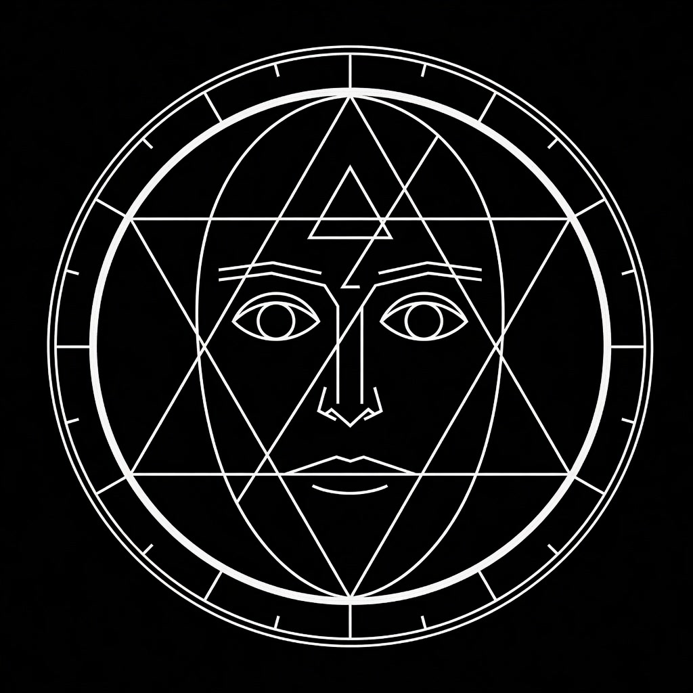

# 🌐 Zoth Studio — Public Showcase, Creative Suites & Documentation Hub (v2.6.0)

<p align="center">
  
</p>

<p align="center">
  <strong>Static Production-Ready Web Application & Creative Engineering Launchpad</strong><br>
  <em>23+ Specialized Creative Suites · Nexus 3D Viewport · Swarm Arena · OmniPost 2.0 · Argon2id Vault</em>
</p>

---

## 🌟 Overview
This directory (`core-app/public/`) contains the static frontend suites for Zoth Studio. It is designed to be served locally on port `8088` or deployed to static edge networks (Netlify, Cloudflare Pages, Vercel) with **zero build step requirements**.

---

## 🏛️ Comprehensive Web Suites Directory

| Suite / Launchpad | Local Path | Description & Features |
| :--- | :--- | :--- |
| **Flagship Hub** | [`index.html`](index.html) | Master showcase, system telemetry, 3D hero canvas, and quickstart runbook. |
| **Documentation Portal** | [`docs/index.html`](docs/index.html) | Searchable operator manual, 47-tool directory, hardware pinout tables, and API references. |
| **Nexus 3D Omniverse** | [`studio/nexus-3d.html`](studio/nexus-3d.html) | Three.js CAD viewport with GLTF asset loader, Wireframe/PBR/Points modes, and procedural lighting rigs. |
| **Swarm Command Arena** | [`studio/swarm.html`](studio/swarm.html) | 3D Craig Reynolds Boids flocking arena, multi-agent conversation telemetry, and agent bus events. |
| **Consensus Arena v2** | [`studio/consensus.html`](studio/consensus.html) | Autonomous 3-agent arbitration engine with live Shannon entropy calculation and Jaccard token overlap metrics. |
| **OmniPost 2.0 Video Engine** | [`studio/omnipost.html`](studio/omnipost.html) | 60 FPS HTML5 Canvas video generator, 16:9 thumbnail forge, subtitle syncer, and Web Speech API narration. |
| **Vision Link Spatial HUD** | [`studio/vision-link.html`](studio/vision-link.html) | Webcam-based computer vision hand gesture tracking, 3D overlays, air typing keyboard, and touchless window pinch-zooming. |
| **AI Math Observability** | [`studio/math-pillars.html`](studio/math-pillars.html) | Real-time cross-entropy loss descent, cosine learning rate schedulers, and neural weight convergence visualizer. |
| **Visual DAG Agent Composer**| [`studio/agent-composer.html`](studio/agent-composer.html) | Interactive node graph editor with bezier connecting wires, conditional logic branches, and JSON playbook exporter. |
| **Edge Function Forge** | [`studio/edge-forge.html`](studio/edge-forge.html) | Serverless V8 isolate code editor with built-in rate limiters, Solana RPC connectors, and waterfall latency telemetry. |
| **SubSweep Reconnaissance** | [`studio/subsweep.html`](studio/subsweep.html) | OSINT attack surface scanner, Certificate Transparency log probe, and TLS 1.3 cryptographic security auditor. |
| **AI Model Foundry** | [`studio/models.html`](studio/models.html) | Ollama local model benchmark arena with latency waterfall charts and interactive prompt testing. |
| **Argon2id BYOK Vault** | [`vault/index.html`](vault/index.html) | Zero-leak hardware key store encrypted with Argon2id ($m=64\text{MB}, t=3, p=4$) and XChaCha20-Poly1305 AEAD. |
| **Tool Bench & Harness** | [`studio/tool-bench.html`](studio/tool-bench.html) | Contract-validated uniform console for 47+ chained tools with schema verification and live bus telemetry. |
| **Pet Sanctuary 3D** | [`pets/index.html`](pets/index.html) | 24 Cyber Pet Companion 3D hangar with procedural voxel shaders and interaction prompts. |

---

## 🚀 Running Locally

```bash
# Serve static directory on loopback:
python3 -m http.server 8088 --bind 127.0.0.1 --directory .
```

Visit: [http://127.0.0.1:8088/](http://127.0.0.1:8088/)
