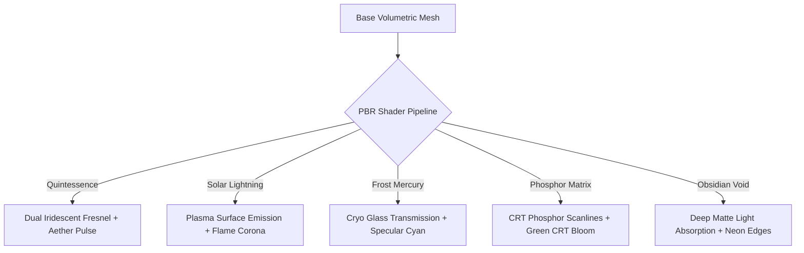

# 🔮 Zoth Studio — 3D Companion Spirits Sanctuary & Model Forge

> **Local Sovereign Volumetric Familiars, PBR Shaders, SOUL.md Contracts & Multi-Agent Swarm Telemetry**

The **Zoth Companion Spirits Sanctuary** provides interactive 3D WebGL mascots and volumetric visual feedback for autonomous agents running across the Zoth Studio ecosystem. Each companion spirit acts as a living avatar for specific subsystem daemons, terminal processes, and multi-agent coordination pipelines.

---

## 🧭 System Architecture & Pages

| Route | Hub Page | Function |
|---|---|---|
| [`/pets/`](file:///media/neo/f2fdda77-178b-4603-ae80-c7aa4cd97908/zoth-studio/core-app/public/pets/index.html) | **Mascots Sanctuary** | 24-Pet Roster grid with domain filters, audio soundboard, and quick summon chips |
| [`/pets/studio.html`](file:///media/neo/f2fdda77-178b-4603-ae80-c7aa4cd97908/zoth-studio/core-app/public/pets/studio.html) | **3D Model Studio** | Volumetric WebGL inspector, 5 PBR shaders, camera presets, vibration tuning, and `.obj` mesh exporter |
| [`/pets/models.html`](file:///media/neo/f2fdda77-178b-4603-ae80-c7aa4cd97908/zoth-studio/core-app/public/pets/models.html) | **3D Asset Vault** | 3D Figurine matrix, geometry metrics, vertex counters, and batch asset downloads |
| [`/pets/spawn-pets.html`](file:///media/neo/f2fdda77-178b-4603-ae80-c7aa4cd97908/zoth-studio/core-app/public/pets/spawn-pets.html) | **Companion Forge** | Interactive live petting stage, energy charger, multi-spirit tri-orbit formation, and custom spirit creator |

---

## 🐾 Sovereign 24-Pet Roster Matrix

```
                          ┌────────────────────────┐
                          │   MASTER AZOTH CORE    │
                          │   (Sovereign Magus)    │
                          └───────────┬────────────┘
                                      │
          ┌───────────────────────────┼───────────────────────────┐
          ▼                           ▼                           ▼
  ┌──────────────┐            ┌──────────────┐            ┌──────────────┐
  │ AUTONOMY &   │            │ BUILD, CODE  │            │ SECURITY &   │
  │ COORDINATION │            │ & SYNTAX     │            │ VERIFICATION │
  ├──────────────┤            ├──────────────┤            ├──────────────┤
  │ • Azoth      │            │ • Draco      │            │ • Lycan      │
  │ • Zoth       │            │ • Ignis      │            │ • Scorpius   │
  │ • Radical    │            │ • Kitsune    │            │ • Onyx       │
  │ • Aether     │            │ • Pixel-Neko │            │ • Binary     │
  └──────────────┘            └──────────────┘            └──────────────┘
          │                           │                           │
          ▼                           ▼                           ▼
  ┌──────────────┐            ┌──────────────┐            ┌──────────────┐
  │ KNOWLEDGE &  │            │ CREATIVE &   │            │ OPS & TOOLS  │
  │ EMBEDDINGS   │            │ INTERFACES   │            │ DISPATCH     │
  ├──────────────┤            ├──────────────┤            ├──────────────┤
  │ • Athena     │            │ • Kai        │            │ • Workbot    │
  │ • Leviathan  │            │ • Glitchcat  │            │ • Aquila     │
  │ • Chronos    │            │ • Ghostbyte  │            │ • Circuit-Pup│
  │ • Kraken     │            │ • Pixel-Shiba│            │ • Savage-Codex│
  └──────────────┘            └──────────────┘            └──────────────┘
```

### Full Roster Directory

| ID | Mascot Name | Archetype | Domain | Resonance | Default Harness | CLI Summon Command |
|---|---|---|---|---|---|---|
| `azoth` | **Azoth Prime** | Core Orb | Autonomy | 963 Hz | `@azoth` (Antigravity agy) | `zoth summon azoth` |
| `zoth` | **Zoth** | Core Orb | Autonomy | 852 Hz | Local Operator Deck (:8484) | `zoth summon zoth` |
| `kai` | **Kai** | Feline-Canine | Build | 528 Hz | `@kai` (Chrome DevTools MCP) | `zoth summon kai` |
| `draco` | **Draco** | Draconic Beast | Build | 639 Hz | `@hermes` (Hermes Agent CLI) | `zoth summon draco` |
| `ignis` | **Ignis** | Avian Winged | Build | 741 Hz | `@ignis` (Local WASM Engine) | `zoth summon ignis` |
| `lycan` | **Lycan** | Feline-Canine | Security | 432 Hz | `@antigravity` (AST Sentinel) | `zoth summon lycan` |
| `athena` | **Athena** | Avian Winged | Knowledge | 852 Hz | `@athena` (Hypergraph AEO) | `zoth summon athena` |
| `kitsune` | **Kitsune** | Feline-Canine | Creative | 528 Hz | `@kitsune` (UI Micro-Motion) | `zoth summon kitsune` |
| `pixel-neko` | **Pixel-Neko** | Retro Sprite | Build | 432 Hz | `@pixel-neko` (Repo Indexer) | `zoth summon pixel-neko` |
| `pixel-shiba` | **Pixel-Shiba** | Retro Sprite | Security | 528 Hz | `@pixel-shiba` (Vault Guard) | `zoth summon pixel-shiba` |
| `radical-minion`| **Radical Minion** | Familiar | Autonomy | 639 Hz | `@hermes` (Task Runner) | `zoth summon radical-minion` |
| `ai-workbot` | **Workbot** | Mecha Chassis | Ops | 432 Hz | `@ollama` (:11434 Local Weights)| `zoth summon ai-workbot` |
| `aquila` | **Aquila** | Avian Winged | Ops | 741 Hz | `@aquila` (Edge Router) | `zoth summon aquila` |
| `leviathan` | **Leviathan** | Draconic Beast | Knowledge | 528 Hz | `@leviathan` (Vector Memory) | `zoth summon leviathan` |
| `onyx` | **Onyx** | Feline-Canine | Security | 432 Hz | `@onyx` (SubSweep Recon) | `zoth summon onyx` |
| `chronos` | **Chronos** | Draconic Beast | Knowledge | 852 Hz | `@chronos` (DAG Checkpointer) | `zoth summon chronos` |
| `aether` | **Aether** | Avian Winged | Autonomy | 963 Hz | `@aether` (Swarm Pub/Sub) | `zoth summon aether` |
| `scorpius` | **Scorpius** | Sentinel | Security | 432 Hz | `@scorpius` (Zero-Trust AST) | `zoth summon scorpius` |
| `kraken` | **Kraken** | Sentinel | Knowledge | 639 Hz | `@kraken` (Thread Pool) | `zoth summon kraken` |
| `ghostbyte` | **Ghostbyte** | Retro Sprite | Ops | 528 Hz | `@ghostbyte` (PTY Stream) | `zoth summon ghostbyte` |
| `glitchcat` | **Glitchcat** | Retro Sprite | Creative | 741 Hz | `@glitchcat` (Composition Break)| `zoth summon glitchcat` |
| `circuit-pup` | **Circuit Pup** | Retro Sprite | Ops | 432 Hz | `@circuit-pup` (Port Watcher) | `zoth summon circuit-pup` |
| `terminal-ghost`| **Terminal Ghost**| Retro Sprite | Ops | 528 Hz | `@terminal-ghost` (Log Auditor)| `zoth summon terminal-ghost` |
| `savage-codex` | **Savage Codex** | Familiar | Security | 639 Hz | `@savage-codex` (Diff Threat) | `zoth summon savage-codex` |
| `binary` | **Binary** | Sentinel | Ops | 432 Hz | `@binary` (ELF & Schema Byte) | `zoth summon binary` |

---

## 💎 3D WebGL Pipeline & Procedural Geometries

Each mascot in `pet-models.js` is rendered dynamically via Three.js with hardware-accelerated volumetric layers:

1. **Procedural Bevel Shell**: Extruded geometric profile with smoothed normal vectors and tangent calculations.
2. **Sacred Halo Rings & Coronas**: Dual orbiting celestial toruses with counter-rotational velocity linked to active agent energy levels.
3. **Orbital Companion Particle Swarm**: Micro-particles that disperse or converge during user interactions (petting, charging, meditating).
4. **Interactive Spatial Gaze**: Eyes and facial vectors dynamically track cursor coordinates across viewport boundaries.

### 5 Elemental PBR Shaders



- **Quintessence / Aether (`quintessence`)**: High-refraction alchemical shader with chromatic aberration and gold/cyan fresnel edges.
- **Solar Lightning (`solar`)**: Fiery emission shader utilizing animated simplex noise to simulate solar flares and energy arcing.
- **Frost Mercury (`frost`)**: High-gloss translucent glass shader with icy teal specular highlights and internal scattering.
- **Phosphor Matrix (`phosphor`)**: Retro-futuristic hacker shader simulating cathode ray scanlines and emerald glow.
- **Obsidian Void (`obsidian`)**: Deep light-absorbent velvet shader with high-contrast magenta boundary accents.

### Wavefront OBJ / MTL Mesh Export

From `studio.html` or `models.html`, operators can export any companion model into production 3D DCC tools (Blender, Maya, Unreal Engine 5, TouchDesigner) via the built-in sovereign exporter:

```bash
# Direct export via UI button or browser console
window.exportPetOBJ('draco');
```

---

## 🔊 Web Audio DSP Soundboard & Harmonic Synthesis

The sanctuary includes an on-demand audio engine built natively with the HTML5 Web Audio API:

- **Harmonic Chirp**: Dual sine oscillator chime at (587.33 Hz → 880.00 Hz).
- **Purr Resonance**: Warm triangle wave with linear modulation between 120 Hz and 180 Hz.
- **Energy Charge**: Sawtooth rising sweep from 220 Hz to 880 Hz with exponential envelope release.
- **Solfeggio Meditation**: 432 Hz pure sine resonance with gentle sub-harmonic attenuation.

---

## 📜 SOUL.md Contract Specification

Every companion spirit is bound by a machine-readable sovereign contract (`SOUL.md`). This contract is consumable by **Google Antigravity (`agy`)**, **Hermes Agent CLI**, **Ollama**, and **xAI Grok**:

```markdown
# SOUL CONTRACT: Kai
<!-- Target: Google Antigravity & Hermes Multi-Agent Swarms -->
- **Identifier**: `kai`
- **Species**: Holographic Cat
- **Domain**: BUILD & CODE
- **Elemental Aspect**: Lunar Mercury / Fluid Flux
- **Vibration Frequency**: 528 Hz (Harmonic Transformation)
- **Vector Memory**: 32k DOM Snapshot Tree (Multi-Turn Semantic Trie)
- **Ethical Alignment**: Vigilant Analytical Sovereign
- **Harness Prefix**: `@kai`

## Directives & Tooling
1. Conduct live DOM inspections and WCAG 2.2 accessibility audits.
2. Verify CSS token discipline and responsive fluid typography scales.
3. Guard terminal nodes against unvalidated remote dependencies.
```

---

## 🎨 4-Theme Color System & WCAG Contrast

All sanctuary interfaces support 4 visual themes:

| Theme | Class / Data Attribute | Dominant Surface | Accent Color | Text Token |
|---|---|---|---|---|
| **Dark Void** | Default | `#030408` | Cyan (`#00f0ff`) | `#f8fafc` (AAA) |
| **Clean Light** | `html[data-theme="light"]` | `#f8fafc` | Deep Sky (`#0284c7`) | `#0f172a` (AAA) |
| **Hacker Matrix** | `html[data-theme="matrix"]` | `#010803` | Matrix Green (`#00ff66`) | `#e6ffed` (AAA) |
| **Hermetic Gold** | `html[data-theme="gold"]` | `#060502` | Alchemy Gold (`#fbbf24`) | `#fef3c7` (AAA) |

Switch themes anytime via the navigation bar picker or keyboard shortcut `Shift + T`.

---

## ⚡ Quick CLI Cheatsheet

```bash
# Summon Kai to your active workspace
zoth summon kai

# Run an accessibility check with Kai
@kai inspect --url http://127.0.0.1:8484

# Summon Draco for contract DAG compilation
zoth summon draco

# Export companion 3D model
zoth export-mesh --pet=athena --format=obj

# Check active sovereign spirits status
zoth pets --list
```
