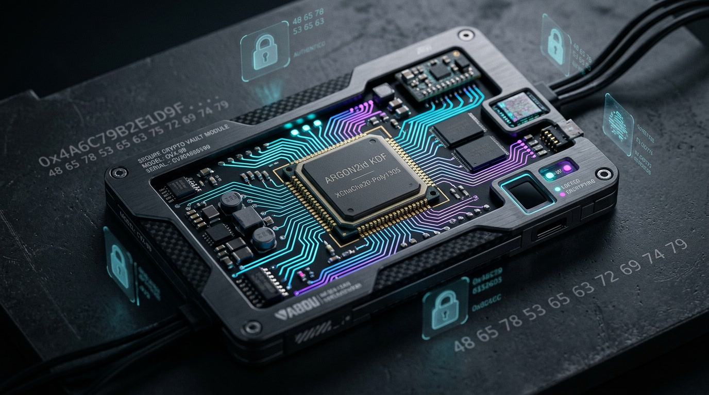

<div align="center">

#  ZOTH STUDIO `vault-ui`

**Interactive 3D WebGL Interface for the Argon2id Vault Daemon**

[](http://127.0.0.1:8088/vault/)
[](http://127.0.0.1:8088/vault/)

<br>

<p align="center">
  
</p>

</div>

---

## 🔐 Overview

This is the interactive client-side 3D WebGL interface for managing **API keys and sensitive tokens** within the Zoth Studio ecosystem. It visually represents keys as category-colored shards floating inside a glass cube.

By design, this frontend executes **strictly in the browser** and connects exclusively to the local Rust-based Vault Daemon at `http://127.0.0.1:8686`. 

## ✨ Key Capabilities

| Feature | Description |
|--------|----------------|
| **Auto-Detect** | Paste `sk-ant-…`, `gsk_…`, `sk_test_…` → instantly infers the service + confidence score. |
| **Preset Packs** | 160+ presets across Agent stacks, LLMs, Vector DBs, SaaS, Indie, Web3, and Custom APIs. |
| **Smart Paste** | Copy a `.env` block or `export KEY=…` list to bulk import safely. |
| **3D Data Viz** | Scatter (`X`) and Orbit (`R`) keys out of the main cube for visual inspection. |
| **HUD & TTL** | Heads-up display warns when the daemon session is expiring (< 60s). |

## 🕹️ Keyboard Shortcuts

`N` New Key · `P` Presets · `/` Filter · `E` Export · `L` Lock Session · `R` Orbit · `F` Focus · `X` Scatter · `C` Copy · `V` Reveal · `S` Star · `1–9` Select · `?` Help

## 🛡️ Security Guarantees

*   **Zero Telemetry**: Secrets *never* leave the browser context unless you manually export or copy them.
*   **Memory Wipe**: Locking the session instantly drops unsealed keys from browser memory.
*   **No Cloud Recovery**: The Vault Daemon requires your master passphrase. If lost, the vault is irreversibly cryptoshredded.

## 🚀 Setup & Linking

The UI auto-detects `http://127.0.0.1:8686`. Ensure the daemon is running before interacting:

```bash
cd ../../../vault-daemon
cargo run --release -- --port 8686
```
